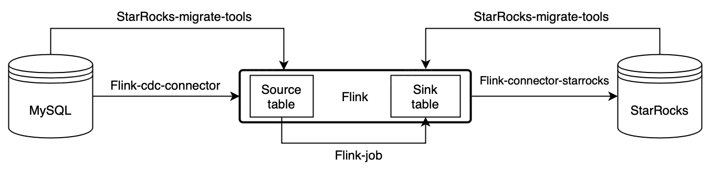

# MySQL 实时同步至StarRocks

## 功能简介

StarRocks 提供 Flink CDC connector、flink-connector-starrocks 和 StarRocks-migrate-tools（简称smt），实现 MySQL 数据实时同步至 StarRocks，满足业务实时场景的数据分析。

## 基本原理

通过 Flink CDC connector、flink-connector-starrocks 和 smt 可以实现 MySQL 数据的秒级同步至StarRocks。



如图所示，Smt 可以根据 MySQL 和 StarRocks 的集群信息和表结构自动生成 source table 和 sink table 的建表语句。  
通过 Flink-cdc-connector 消费 MySQL 的 binlog，然后通过 Flink-connector-starrocks 写入 StarRocks。

## 操作步骤

1. 修改/etc/my.cnf，开启 MySQL binlog
  
    ``` bash
    #开启 binlog 日志
    log-bin =/var/lib/mysql/mysql-bin

    #log_bin = ON
    ##binlog 日志的基本文件名
    #log_bin_basename =/var/lib/mysql/mysql-bin
    ##binlog 文件的索引文件，管理所有 binlog 文件
    #log_bin_index =/var/lib/mysql/mysql-bin.index
    #配置 serverid
    server-id = 1
    binlog_format = row
    ```
  
    重启mysqld，然后可以通过 SHOW VARIABLES LIKE 'log_bin'; 确认是否已经打开。

2. 下载 [Flink](https://flink.apache.org/downloads.html), 推荐使用 1.13，最低支持版本 1.11。
3. 下载 [Flink CDC connector](https://github.com/ververica/flink-cdc-connectors/releases)，请注意下载对应 Flink 版本的 Flink-MySQL-CDC。
4. 下载 [Flink-connector-starrocks](https://github.com/StarRocks/flink-connector-starrocks)，请注意 1.13 版本和 1.11/1.12 版本使用不同的 connector.
5. 复制 `flink-sql-connector-mysql-cdc-xxx.jar`, `flink-connector-starrocks-xxx.jar` 到 `flink-xxx/lib/`。

   > 注意：
   > 如果 Flink 已经处于运行状态中，则需要重启 Flink ，加载并生效 jar 包。
   >
   > ``` bash
   > $ ./bin/stop-cluster.sh
   > $ ./bin/start-cluster.sh
   > ```

6. 下载并解压 [smt.tar.gz](https://www.starrocks.com/zh-CN/download/community)
7. 解压并修改配置文件
    * `Db` 需要修改成 MySQL 的连接信息。  
    * `be_num` 需要配置成 StarRocks 集群的节点数（这个能帮助更合理的设置 bucket 数量）。  
    * `[table-rule.1]` 是匹配规则，可以根据正则表达式匹配数据库和表名生成建表的 SQL，也可以配置多个规则。  
    * `flink.starrocks.*` 是 StarRocks 集群配置信息和导入任务的配置信息。配置信息的更多说明，请参见 [Flink-connector-starrocks 配置](../loading/Flink-connector-starrocks.md)。自 2.4 版本起，如果您需要更新主键模型的部分列，则可以配置参数 `flink.starrocks.sink.properties.partial_update=true`、`flink.starrocks.sink.properties.columns=k1,k2,k3`。
  
        ```bash
        [db]
        host = 192.168.1.1
        port = 3306
        user = root
        password =  

        [other]
        # number of backends in StarRocks
        be_num = 3
        # `decimal_v3` is supported since StarRocks-1.18.1
        use_decimal_v3 = false
        # file to save the converted DDL SQL
        output_dir = ./result
        
        [table-rule.1]
        # pattern to match databases for setting properties
        database = ^console_19321.*$
        # pattern to match tables for setting properties
        table = ^.*$

        ############################################
        ### flink sink configurations
        ### DO NOT set `connector`, `table-name`, `database-name`, they are auto-generated
        ############################################
        flink.starrocks.jdbc-url=jdbc:mysql://192.168.1.1:9030
        flink.starrocks.load-url= 192.168.1.1:8030
        flink.starrocks.username=root
        flink.starrocks.password=
        flink.starrocks.sink.properties.column_separator=\x01
        flink.starrocks.sink.properties.row_delimiter=\x02
        flink.starrocks.sink.buffer-flush.interval-ms=15000
        ```

8. 执行 starrocks-migrate-tool，flink 和 starrocks 建表语句都生成在 result 目录下

    ```bash
    $./starrocks-migrate-tool
    $ls result
    flink-create.1.sql    smt.tar.gz              starrocks-create.all.sql
    flink-create.all.sql  starrocks-create.1.sql
    ```

9. 利用上一步生成的 StarRocks 的建表语句在 StarRocks 中建表

    ```bash
    Mysql -hxx.xx.xx.x -P9030 -uroot -p < starrocks-create.1.sql
    ```

10. 执行如下语句，生成Flink table 并开始同步，同步任务会持续执行

    > 需要确保flink集群已经启动，未启动可以使用flink/bin/start-cluster.sh启动

    ```bash
    bin/sql-client.sh -f flink-create.1.sql
    ```

    这个执行以后同步任务会持续执行
    > 如果是 Flink 1.13 之前的版本可能无法直接执行脚本，需要逐行提交

11. 观察任务状况
  
    ```bash
    bin/flink list 
    ```

  上述命令可以查看 flink 同步任务状态，如果有任务请查看 log 日志，或者调整 conf/flink-conf.yaml 中的系统配置中内存和 slot，具体配置请参考 [Flink 配置参数](https://nightlies.apache.org/flink/flink-docs-master/zh/docs/deployment/config/)。

## 注意事项

* 如果有多组规则，需要给每一组规则匹配 database，table 和 flink-connector 的配置

    ```bash
    [table-rule.1]
    # pattern to match databases for setting properties
    database = ^console_19321.*$
    # pattern to match tables for setting properties
    table = ^.*$

    ############################################
    ### flink sink configurations
    ### DO NOT set `connector`, `table-name`, `database-name`, they are auto-generated
    ############################################
    flink.starrocks.jdbc-url=jdbc:mysql://192.168.1.1:9030
    flink.starrocks.load-url= 192.168.1.1:8030
    flink.starrocks.username=root
    flink.starrocks.password=
    flink.starrocks.sink.properties.column_separator=\x01
    flink.starrocks.sink.properties.row_delimiter=\x02
    flink.starrocks.sink.buffer-flush.interval-ms=15000

    [table-rule.2]
    # pattern to match databases for setting properties
    database = ^database2.*$
    # pattern to match tables for setting properties
    table = ^.*$

    ############################################
    ### flink sink configurations
    ### DO NOT set `connector`, `table-name`, `database-name`, they are auto-generated
    ############################################
    flink.starrocks.jdbc-url=jdbc:mysql://192.168.1.1:9030
    flink.starrocks.load-url= 192.168.1.1:8030
    flink.starrocks.username=root
    flink.starrocks.password=
    # 如果导入数据不方便选出合适的分隔符可以考虑使用 Json 格式，但是会有一定的性能损失, 使用方法：用以下参数替换 flink.starrocks.sink.properties.column_separator 和 flink.starrocks.sink.properties.row_delimiter 参数
    flink.starrocks.sink.properties.strip_outer_array=true
    flink.starrocks.sink.properties.format=json
    ```

* 针对分库分表的大表可以单独配置一个规则，比如：有两个数据库 edu_db_1，edu_db_2，每个数据库下面分别有course_1，course_2 两张表，并且所有表的数据结构都是相同的，通过如下配置把他们导入StarRocks的一张表中进行分析。

    ``` bash
    [table-rule.3]
    # pattern to match databases for setting properties
    database = ^edu_db_[0-9]*$
    # pattern to match tables for setting properties
    table = ^course_[0-9]*$

    ############################################
    ### flink sink configurations
    ### DO NOT set `connector`, `table-name`, `database-name`, they are auto-generated
    ############################################
    flink.starrocks.jdbc-url = jdbc: mysql://192.168.1.1:9030
    flink.starrocks.load-url = 192.168.1.1:8030
    flink.starrocks.username = root
    flink.starrocks.password =
    flink.starrocks.sink.properties.column_separator =\x01
    flink.starrocks.sink.properties.row_delimiter =\x02
    flink.starrocks.sink.buffer-flush.interval-ms = 5000
    ```

    这样会自动生成一个多对一的导入关系，在StarRocks默认生成的表名是 course__auto_shard，也可以自行在生成的配置文件中修改。

* 如果在sql-client中命令行执行建表和同步任务，需要做对'\'字符进行转义

    ``` bash
    'sink.properties.column_separator' = '\\x01'
    'sink.properties.row_delimiter' = '\\x02'  
    ```

* 如果需要导入的表过多，占用了大量Flink Job资源，对于Flink-1.13及以上版本，可以使用STATEMENT SET语法将多个表的CDC任务合并到同一个Job。方法如下：打开result/flink-create.x.sql文件，调整里面的sql顺序，其中的create database，create sink/source table 的位置保持不变，将所有的insert into语句调整位置到文件末尾。然后在insert语句的第一句前面加上一行  BEGIN STATEMENT SET;  在最后一条insert语句后面加上一行END;  最后执行 bin/sql-client.sh -f flink-create.1.sql。示例：

    ``` sql
    CREATE DATABASE IF NOT EXISTS db;
    CREATE TABLE IF NOT EXISTS db.a1;
    CREATE TABLE IF NOT EXISTS db.b1;
    CREATE TABLE IF NOT EXISTS db.a2;
    CREATE TABLE IF NOT EXISTS db.b2;
    BEGIN STATEMENT SET;
    INSERT INTO db.a1 SELECT * FROM db.b1;
    INSERT INTO db.a2 SELECT * FROM db.b2;
    END; 
    ```
