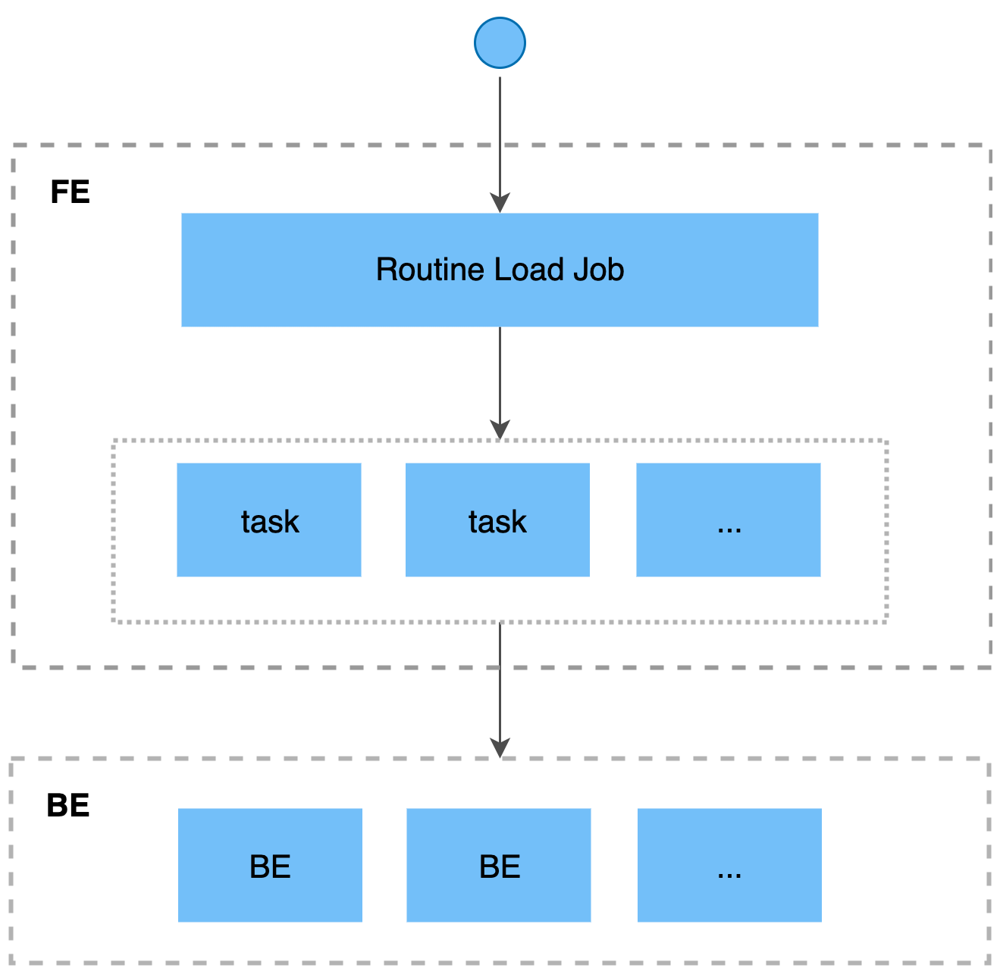

# 从 Apache Kafka® 持续导入

本文介绍 Routine Load 的基本原理、以及如何通过 Routine Load 持续消费 Apache Kafka® 的消息并导入至 StarRocks 中。

如果您需要将消息流不间断地导入至 StarRocks，则可以将消息流存储在 Kafka 的 Topic 中，并向 StarRocks 提交一个 Routine Load 导入作业。 StarRocks 会常驻地运行这个导入作业，持续生成一系列导入任务，消费 Kafka 集群中该 Topic 中的全部或部分分区的消息并导入到 StarRocks 中。

Routine Load 支持 Exactly-Once 语义，能够保证数据不丢不重。

Routine Load 支持在导入过程中做数据转换、以及通过 UPSERT 和 DELETE 操作实现数据变更。请参见[导入过程中实现数据转换](/loading/Etl_in_loading.md)和[通过导入实现数据变更](../loading/Load_to_Primary_Key_tables.md)。

## 支持的数据文件格式

Routine Load 目前支持从 Kakfa 集群中消费 CSV、JSON 格式的数据。

> **说明**
>
> 对于 CSV 格式的数据，需要注意以下两点：
>
> - StarRocks 支持设置长度最大不超过 50 个字节的 UTF-8 编码字符串作为列分隔符，包括常见的逗号 (,)、Tab 和 Pipe (|)。
> - 空值 (null) 用 `\N` 表示。比如，数据文件一共有三列，其中某行数据的第一列、第三列数据分别为 `a` 和 `b`，第二列没有数据，则第二列需要用 `\N` 来表示空值，写作 `a,\N,b`，而不是 `a,,b`。`a,,b` 表示第二列是一个空字符串。

## 基本原理



### 概念

- **导入作业**

  导入作业会常驻运行，当导入作业的状态为 **RUNNING** 时，会持续不断生成一个或多个并行的导入任务，不断消费 Kafka 集群中一个 Topic 的消息，并导入至 StarRocks 中。

- **导入任务**

  导入作业会按照一定规则拆分成若干个导入任务。导入任务是执行导入的基本单位，作为一个独立的事务，通过 [Stream Load](../loading/StreamLoad.md) 导入机制实现。若干个导入任务并行消费一个 Topic 中不同分区的消息，并导入至 StarRocks 中。

### 作业流程

- **创建常驻的导入作业**

  您需要向 StarRocks 提交创建导入作业的 SQL 语句。 FE 会解析 SQL 语句，并创建一个常驻的导入作业。

- **拆分导入作业为多个导入任务**

  FE 将导入作业按照一定规则拆分成若干个导入任务。一个导入任务作为一个独立的事务。

  拆分规则如下：
  - FE 根据期望任务并行度`desired_concurrent_number`、Kafka Topic 的分区数量、存活 BE 数量等，计算得出实际任务并行度。
  - FE 根据实际任务并行度将导入作业分为若干导入任务，放入任务执行队列中。

  每个 Topic 会有多个分区，分区与导入任务之间的对应关系为：
  - 每个分区的消息只能由一个对应的导入任务消费。
  - 一个导入任务可能会消费一个或多个分区。
  - 分区会尽可能均匀地分配给导入任务。

- **多个导入任务并行进行，消费 Kafka 多个分区的消息，导入至 StarRocks**

  - **调度和提交导入任务**：FE 定时调度任务执行队列中的导入任务，分配给选定的 Coordinator BE。调度导入任务的时间间隔由 `max_batch_interval` 参数，并且 FE 会尽可能均匀地向所有 BE 分配导入任务。有关 `max_batch_interval` 参数的详细介绍，请参见  [CREATE ROUTINE LOAD](../sql-reference/sql-statements/data-manipulation/CREATE_ROUTINE_LOAD.md#job_properties)。

  - **执行导入任务**：Coordinator BE 执行导入任务，消费分区的消息，解析并过滤数据。导入任务需要消费足够多的消息，或者消费足够长时间。消费时间和消费的数据量由 FE 配置项 `max_routine_load_batch_size`、`routine_load_task_consume_second`决定，有关该配置项的更多说明，请参见 [配置参数](../administration/Configuration.md#导入和导出)。然后，Coordinator BE 将消息分发至相关 Executor BE 节点， Executor BE 节点将消息写入磁盘。

    > StarRocks 可以通过无认证、SSL 认证、SASL 认证机制连接 Kafka。

- **持续生成新的导入任务，不间断地导入数据**

  Executor BE 节点成功写入数据后， Coordonator BE 会向 FE 汇报导入结果。
  
  FE 根据汇报结果，继续生成新的导入任务，或者对失败的导入任务进行重试，连续地导入数据，并且能够保证导入数据不丢不重。

## 创建导入作业

这里通过两个简单的示例，介绍如何通过 Routine Load 持续消费 Kafka 中 CSV 和 JSON 格式的数据，并导入至 StarRocks 中。有关创建 Routine Load 的详细语法和参数说明，请参见 [CREATE ROUTINE LOAD](../sql-reference/sql-statements/data-manipulation/CREATE_ROUTINE_LOAD.md)。

### 导入 CSV 数据

本小节介绍如何创建一个 Routine Load 导入作业，持续不断地消费 Kafka 集群的 CSV 格式的数据，然后导入至 StarRocks 中。

#### 数据集

假设 Kafka 集群的 Topic `ordertest1` 存在如下 CSV 格式的数据，其中 CSV 数据中列的含义依次是订单编号、支付日期、顾客姓名、国籍、性别、支付金额。

```Plain text
2020050802,2020-05-08,Johann Georg Faust,Deutschland,male,895
2020050802,2020-05-08,Julien Sorel,France,male,893
2020050803,2020-05-08,Dorian Grey,UK,male,1262
2020050901,2020-05-09,Anna Karenina",Russia,female,175
2020051001,2020-05-10,Tess Durbeyfield,US,female,986
2020051101,2020-05-11,Edogawa Conan,japan,male,8924
```

#### 目标数据库和表

根据 CSV 数据中需要导入的几列（例如除第五列性别外的其余五列需要导入至 StarRocks）， 在 StarRocks 集群的目标数据库 `example_db` 中创建表 `example_tbl1`。

```SQL
CREATE TABLE example_db.example_tbl1 ( 
    `order_id` bigint NOT NULL COMMENT "订单编号",
    `pay_dt` date NOT NULL COMMENT "支付日期", 
    `customer_name` varchar(26) NULL COMMENT "顾客姓名", 
    `nationality` varchar(26) NULL COMMENT "国籍", 
    `price`double NULL COMMENT "支付金额"
) 
ENGINE=OLAP 
PRIMARY KEY (order_id,pay_dt) 
DISTRIBUTED BY HASH(`order_id`) BUCKETS 5; 
```

#### 导入作业

通过如下语句，向StarRocks 提交一个 Routine Load 导入作业 `example_tbl1_ordertest1`，持续消费 Kafka 集群中 Topic `ordertest1` 的消息，并导入至数据库 `example_db` 的表 `example_tbl1` 中。并且导入作业会从该 Topic 所指定分区的最早位点 (Offset) 开始消费。

```SQL
CREATE ROUTINE LOAD example_db.example_tbl1_ordertest1 ON example_tbl1
COLUMNS TERMINATED BY ",",
COLUMNS (order_id, pay_dt, customer_name, nationality, temp_gender, price)
PROPERTIES
(
    "desired_concurrent_number" = "5"
)
FROM KAFKA
(
    "kafka_broker_list" ="<kafka_broker1_ip>:<kafka_broker1_port>,<kafka_broker2_ip>:<kafka_broker2_port>",
    "kafka_topic" = "ordertest1",
    "kafka_partitions" ="0,1,2,3,4",
    "property.kafka_default_offsets" = "OFFSET_BEGINNING"
);
```

提交导入作业后，您可以执行  [SHOW ROUTINE LOAD](../sql-reference/sql-statements/data-manipulation/SHOW_ROUTINE_LOAD.md)，查看导入作业执行情况。

- **导入作业的名称**

  一张表可能有多个导入作业，建议您根据 Kafka Topic 的名称和创建导入作业的大致时间等信息来给导入作业命名，这样有助于区分同一张表上的不同导入作业。

- **列分隔符**

  `COLUMN TERMINATED BY` 指定 CSV 数据的列分隔符，默认为`\t`。

- **消费分区和起始消费位点**

  如果需要指定分区、起始消费位点，则可以配置参数 `kafka_partitions`、`kafka_offsets`。例如待消费分区为`"0,1,2,3,4"`，并且从每个分区的起始位点开始消费，则可以指定如下配置：

  ```SQL
    "kafka_partitions" ="0,1,2,3,4",
    "kafka_offsets" = "OFFSET_BEGINNING,OFFSET_BEGINNING,OFFSET_BEGINNING,OFFSET_END,OFFSET_END"
  ```

  您也可以使用 `property.kafka_default_offsets` 来设置全部分区的默认消费位点。

  ```SQL
    "kafka_partitions" ="0,1,2,3,4",
    "property.kafka_default_offsets" = "OFFSET_BEGINNING"
  ```

  更多参数说明，请参见 [CREATE ROUTINE LOAD](../sql-reference/sql-statements/data-manipulation/CREATE_ROUTINE_LOAD.md#data_sourcedata_source_properties)。

- **数据转换**

  如果需要指定源数据和目标表之间列的映射和转换关系，则需要配置 `COLUMNS` 。`COLUMNS`中列的**顺序**与 **CSV 数据**中列的顺序一致，并且**名称**与**目标表**中的列名对应。本示例中，由于无需导入 CSV 数据的第五列至目标表，因此`COLUMNS`中把第五列临时命名为 `temp_gender` 用于占位，其他列都直接映射至表`example_tbl1`中。

  更多数据转换的说明，请参见[导入时实现数据转换](./Etl_in_loading.md)。

  > 如果 CSV 数据中列的名称、顺序和数量都能与目标表中列完全对应，则无需配置 `COLUMNS` 。

- **增加实际任务并行度 加快导入速度**

  当分区数量较多，并且 BE 节点数量充足时，如果您期望加快导入速度，则可以增加实际任务并行度，将一个导入作业分成尽可能多的导入任务并行执行。

  实际任务并行度由如下多个参数组成的公式决定。如果需要增加实际任务并行度，您可以在创建Routine Load 导入作业时为单个导入作业设置较高的期望任务并行度 `desired_concurrent_number` ，以及设置较高的  Routine Load 导入作业的默认最大任务并行度的`max_routine_load_task_concurrent_num` ，该参数为 FE 动态参数，详细说明，请参见 [配置参数](../administration/Configuration.md#导入和导出)。此时实际任务并行度上限为存活 BE 节点数量或者指定分区数量。

  本示例中存活 BE 数量为 5， 指定分区数量为 5，`max_routine_load_task_concurrent_num` 为默认值 `5`，如果需要增加实际任务并发度至上限，则需要将 `desired_concurrent_number` 为 `5`（默认值为 3），计算出实际任务并行度为 5。

  ```Plain
    min(aliveBeNum, partitionNum, desired_concurrent_number, max_routine_load_task_concurrent_num)
  ```
  
  更多调整导入速度的说明，请参见 [Routine Load 常见问题](../faq/loading/Routine_load_faq.md)。

### 导入 JSON 数据

#### 数据集

假设 Kafka 集群的 Topic `ordertest2` 中存在如下 JSON 格式的数据。其中一个JSON 对象中 key 的含义依次是 品类 ID、顾客姓名、顾客国籍、支付日期、支付金额。

并且，您希望在导入时进行数据转换，将 JSON 数据中的 `pay_time` 键转换为 DATE 类型，并导入到目标表的列`pay_dt`中。

```JSON
{"commodity_id": "1", "customer_name": "Mark Twain", "country": "US","pay_time": 1589191487,"price": 875}
{"commodity_id": "2", "customer_name": "Oscar Wilde", "country": "UK","pay_time": 1589191487,"price": 895}
{"commodity_id": "3", "customer_name": "Antoine de Saint-Exupéry","country": "France","pay_time": 1589191487,"price": 895}
```

> 注意：这里每行一个 JSON 对象必须在一个 Kafka 消息中，否则会出现“JSON 解析错误”的问题。

#### 目标数据库和表

根据 JSON 数据中需要导入的 key，在StarRocks 集群的目标数据库 `example_db` 中创建表 `example_tbl2` 。

```SQL
CREATE TABLE `example_tbl2` ( 
    `commodity_id` varchar(26) NULL COMMENT "品类ID", 
    `customer_name` varchar(26) NULL COMMENT "顾客姓名", 
    `country` varchar(26) NULL COMMENT "顾客国籍", 
    `pay_time` bigint(20) NULL COMMENT "支付时间", 
    `pay_dt` date NULL COMMENT "支付日期", 
    `price`double SUM NULL COMMENT "支付金额"
) 
ENGINE=OLAP
AGGREGATE KEY(`commodity_id`,`customer_name`,`country`,`pay_time`,`pay_dt`) 
DISTRIBUTED BY HASH(`commodity_id`) BUCKETS 5; 
```

#### 导入作业

通过如下语句，向 StarRocks  提交一个 Routine Load 导入作业 `example_tbl2_ordertest2`，持续消费 Kafka 集群中 Topic `ordertest2` 的消息，并导入至 `example_tbl2` 表中。并且导入作业会从此 Topic 所指定分区的最早位点开始消费。

```SQL
CREATE ROUTINE LOAD example_db.example_tbl2_ordertest2 ON example_tbl2
COLUMNS(commodity_id, customer_name, country, pay_time, price, pay_dt=from_unixtime(pay_time, '%Y%m%d'))
PROPERTIES
(
    "desired_concurrent_number"="5",
    "format" ="json",
    "jsonpaths" ="[\"$.commodity_id\",\"$.customer_name\",\"$.country\",\"$.pay_time\",\"$.price\"]"
 )
FROM KAFKA
(
    "kafka_broker_list" ="<kafka_broker1_ip>:<kafka_broker1_port>,<kafka_broker2_ip>:<kafka_broker2_port>",
    "kafka_topic" = "ordertest2",
    "kafka_partitions" ="0,1,2,3,4",
    "property.kafka_default_offsets" = "OFFSET_BEGINNING"
);
```

提交导入作业后，您可以执行  [SHOW ROUTINE LOAD](../sql-reference/sql-statements/data-manipulation/SHOW_ROUTINE_LOAD.md)，查看导入作业执行情况。

- **数据格式**

  需要`PROPERTIES`子句的`"format" ="json"`中指定数据格式为 JSON。

- **数据提取和转换**

  如果需要指定源数据和目标表之间列的映射和转换关系，则可以配置 `COLUMNS` 和`jsonpaths`参数。`COLUMNS`中的列名对应**目标表**的列名，列的顺序对应**源数据**中的列顺序。`jsonpaths` 参数用于提取 JSON 数据中需要的字段数据，而后（就像新生成的 CSV 数据一样）被`COLUMNS`参数**按顺序**临时命名。

  由于源数据中`pay_time` 键需要转换为 DATE 类型，导入到目标表的列`pay_dt`，因此`COLUMNS`中需要使用函数`from_unixtime`进行转换。其他字段都能直接映射至表`example_tbl2`中。

  更多数据转换的说明，请参见[导入时实现数据转换](./Etl_in_loading.md)。

  > 如果每行一个 JSON 对象中 key 的名称和数量（顺序不需要对应）都能对应目标表中列，则无需配置 `COLUMNS` 。

## 查看导入作业和任务

### 查看导入作业

执行 [SHOW ROUTINE LOAD](../sql-reference/sql-statements/data-manipulation/SHOW_ROUTINE_LOAD.md)，查看名称为  `example_tbl2_ordertest2` 的导入作业的信息，比如导入作业状态`State`，导入作业的统计信息`Statistic`（消费的总数据行数、已导入的行数等），消费的分区及进度`Progress`等。

如果导入作业状态自动变为 **PAUSED**，则可能为导入任务错误行数超过阈值。错误行数阈值的设置方式，请参考 [CREATE ROUTINE LOAD](../sql-reference/sql-statements/data-manipulation/CREATE_ROUTINE_LOAD.md#job_properties)。您可以参考`ReasonOfStateChanged`、`ErrorLogUrls`报错进行排查和修复。修复后您可以使用 [RESUME ROUTINE LOAD](../sql-reference/sql-statements/data-manipulation/RESUME_ROUTINE_LOAD.md)，恢复 **PAUSED** 状态的导入作业。

如果导入作业状态为 **CANCELLED**，则可能为导入任务执行遇到异常（如表被删除）。您可以参考`ReasonOfStateChanged`、`ErrorLogUrls`报错进行排查和修复。但是修复后，您无法恢复 **CANCELLED** 状态的导入作业。

```SQL
MySQL [example_db]> SHOW ROUTINE LOAD FOR example_tbl2_ordertest2 \G
*************************** 1. row ***************************
                  Id: 63013
                Name: example_tbl2_ordertest2
          CreateTime: 2022-08-10 17:09:00
           PauseTime: NULL
             EndTime: NULL
              DbName: default_cluster:example_db
           TableName: example_tbl2
               State: RUNNING
      DataSourceType: KAFKA
      CurrentTaskNum: 3
       JobProperties: {"partitions":"*","partial_update":"false","columnToColumnExpr":"commodity_id,customer_name,country,pay_time,pay_dt=from_unixtime(`pay_time`, '%Y%m%d'),price","maxBatchIntervalS":"20","whereExpr":"*","dataFormat":"json","timezone":"Asia/Shanghai","format":"json","json_root":"","strict_mode":"false","jsonpaths":"[\"$.commodity_id\",\"$.customer_name\",\"$.country\",\"$.pay_time\",\"$.price\"]","desireTaskConcurrentNum":"3","maxErrorNum":"0","strip_outer_array":"false","currentTaskConcurrentNum":"3","maxBatchRows":"200000"}
DataSourceProperties: {"topic":"ordertest2","currentKafkaPartitions":"0,1,2,3,4","brokerList":"<kafka_broker1_ip>:<kafka_broker1_port>,<kafka_broker2_ip>:<kafka_broker2_port>"}
    CustomProperties: {"kafka_default_offsets":"OFFSET_BEGINNING"}
           Statistic: {"receivedBytes":230,"errorRows":0,"committedTaskNum":1,"loadedRows":2,"loadRowsRate":0,"abortedTaskNum":0,"totalRows":2,"unselectedRows":0,"receivedBytesRate":0,"taskExecuteTimeMs":522}
            Progress: {"0":"1","1":"OFFSET_ZERO","2":"OFFSET_ZERO","3":"OFFSET_ZERO","4":"OFFSET_ZERO"}
ReasonOfStateChanged: 
        ErrorLogUrls: 
            OtherMsg: 
```

> 注意： StarRocks 只支持查看当前正在运行中的导入作业，不支持查看已经停止和未开始的导入作业。

### 查看导入任务

执行 [SHOW ROUTINE LOAD TASK](../sql-reference/sql-statements/data-manipulation/SHOW_ROUTINE_LOAD_TASK.md)，查看导入作业`example_tbl2_ordertest2` 中一个或多个导入任务的信息。比如当前有多少任务正在运行，消费分区及进度`DataSourceProperties`，以及对应的 Coordinator BE 节点 `BeId`。

```SQL
MySQL [example_db]> SHOW ROUTINE LOAD TASK WHERE JobName = "example_tbl2_ordertest2" \G
*************************** 1. row ***************************
              TaskId: 18c3a823-d73e-4a64-b9cb-b9eced026753
               TxnId: -1
           TxnStatus: UNKNOWN
               JobId: 63013
          CreateTime: 2022-08-10 17:09:05
   LastScheduledTime: 2022-08-10 17:47:27
    ExecuteStartTime: NULL
             Timeout: 60
                BeId: -1
DataSourceProperties: {"1":0,"4":0}
             Message: there is no new data in kafka, wait for 20 seconds to schedule again
*************************** 2. row ***************************
              TaskId: f76c97ac-26aa-4b41-8194-a8ba2063eb00
               TxnId: -1
           TxnStatus: UNKNOWN
               JobId: 63013
          CreateTime: 2022-08-10 17:09:05
   LastScheduledTime: 2022-08-10 17:47:26
    ExecuteStartTime: NULL
             Timeout: 60
                BeId: -1
DataSourceProperties: {"2":0}
             Message: there is no new data in kafka, wait for 20 seconds to schedule again
*************************** 3. row ***************************
              TaskId: 1a327a34-99f4-4f8d-8014-3cd38db99ec6
               TxnId: -1
           TxnStatus: UNKNOWN
               JobId: 63013
          CreateTime: 2022-08-10 17:09:26
   LastScheduledTime: 2022-08-10 17:47:27
    ExecuteStartTime: NULL
             Timeout: 60
                BeId: -1
DataSourceProperties: {"0":2,"3":0}
             Message: there is no new data in kafka, wait for 20 seconds to schedule again
```

## 暂停导入作业

执行 [PAUSE ROUTINE LOAD](../sql-reference/sql-statements/data-manipulation/PAUSE_ROUTINE_LOAD.md) 语句后，会暂停导入作业。导入作业会进入 **PAUSED** 状态，但是导入作业未结束，您可以执行 [RESUME ROUTINE LOAD](../sql-reference/sql-statements/data-manipulation/RESUME_ROUTINE_LOAD.md) 语句重启该导入作业。您也可以执行 [SHOW ROUTINE LOAD](../sql-reference/sql-statements/data-manipulation/SHOW_ROUTINE_LOAD.md) 语句查看已暂停的导入作业的状态。

例如，可以通过以下语句，暂停导入作业`example_tbl2_ordertest2`：

```SQL
PAUSE ROUTINE LOAD FOR example_tbl2_ordertest2;
```

## 恢复导入作业

执行 [RESUME ROUTINE LOAD](../sql-reference/sql-statements/data-manipulation/RESUME_ROUTINE_LOAD.md)，恢复导入作业。导入作业会先短暂地进入 **NEED_SCHEDULE** 状态，表示正在重新调度导入作业，一段时间后会恢复至 **RUNNING** 状态，继续消费 Kafka 消息并且导入数据。您可以执行 [SHOW ROUTINE LOAD](../sql-reference/sql-statements/data-manipulation/SHOW_ROUTINE_LOAD.md) 语句查看已恢复的导入作业。

例如，可以通过以下语句，恢复导入作业`example_tbl2_ordertest2`：

```SQL
RESUME ROUTINE LOAD FOR example_tbl2_ordertest2;
```

## 修改导入作业

修改前，您需要先执行 PAUSE ROUTINE LOAD 暂停导入作业。然后执行 [ALTER ROUTINE LOAD](../sql-reference/sql-statements/data-manipulation/alter-routine-load.md) 语句，修改导入作业的参数配置。修改成功后，您需要执行 [RESUME ROUTINE LOAD](../sql-reference/sql-statements/data-manipulation/RESUME_ROUTINE_LOAD.md)，恢复导入作业。然后执行  [SHOW ROUTINE LOAD](../sql-reference/sql-statements/data-manipulation/SHOW_ROUTINE_LOAD.md) 语句查看修改后的导入作业。

例如，当存活 BE 节点数增至 6 个，待消费分区为`"0,1,2,3,4,5,6,7"`时，如果您希望提高实际的导入并行度，则可以通过以下语句，将期望任务并行度`desired_concurrent_number` 增加至 `6`（大于等于存活 BE 节点数），并且调整待消费分区和起始消费位点。

> 说明：由于实际导入并行度由多个参数的最小值决定，此时，您还需要确保 FE 动态参数 `routine_load_task_consume_second`的值大于或等于 `6`。

```SQL
ALTER ROUTINE LOAD FOR example_tbl2_ordertest2
PROPERTIES
(
    "desired_concurrent_number" = "6"
)
FROM kafka
(
    "kafka_partitions" = "0,1,2,3,4,5,6,7",
    "kafka_offsets" = "OFFSET_BEGINNING,OFFSET_BEGINNING,OFFSET_BEGINNING,OFFSET_BEGINNING,OFFSET_END,OFFSET_END,OFFSET_END,OFFSET_END"
);
```

## 停止导入作业

执行  [STOP ROUTINE LOAD](../sql-reference/sql-statements/data-manipulation/STOP_ROUTINE_LOAD.md)，可以停止导入作业。导入作业会进入 **STOPPED** 状态，代表此导入作业已经结束，且无法恢复。再次执行 SHOW ROUTINE LOAD 语句，将无法看到已经停止的导入作业。

例如，可以通过以下语句，停止导入作业`example_tbl2_ordertest2`：

```SQL
STOP ROUTINE LOAD FOR example_tbl2_ordertest2;
```

## 常见问题

请参见 [Routine Load 常见问题](../faq/loading/Routine_load_faq.md)。
