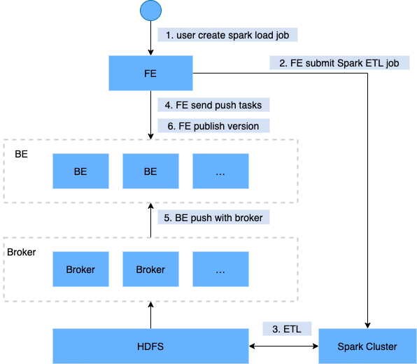

# Spark Load

Spark Load 通过外部的 Spark 资源实现对导入数据的预处理，提高 StarRocks 大数据量的导入性能并且节省 StarRocks 集群的计算资源。主要用于**初次迁移**、**大数据量导入** StarRocks 的场景（数据量可到TB级别）。

Spark Load 是一种**异步**导入方式，用户需要通过 MySQL 协议创建 Spark 类型导入任务，并可以通过 SHOW LOAD 查看导入结果。

> **注意**
>
> * 使用 Spark Load 导入数据至 StarRocks 表时，不支持该表分桶列的数据类型为 DATE、DATETIME 或者 DECIMAL。
> * Spark Load 不支持导入至主键模型表。

## 名词解释

* **Spark ETL**：在导入流程中主要负责数据的 ETL 工作，包括全局字典构建（BITMAP类型）、分区、排序、聚合等。
* **Broker**：Broker 为一个独立的无状态进程。封装了文件系统接口，提供 StarRocks 读取远端存储系统中文件的能力。
* **全局字典**：保存了数据从原始值到编码值映射的数据结构，原始值可以是任意数据类型，而编码后的值为整型；全局字典主要应用于精确去重预计算的场景。

---

## 基本原理

用户通过 MySQL 客户端提交 Spark 类型导入任务，FE记录元数据并返回用户提交成功。

Spark Load 任务的执行主要分为以下几个阶段：

1. 用户向 FE 提交 Spark Load 任务；
2. FE 调度提交 ETL 任务到 Spark 集群执行。
3. Spark 集群执行 ETL 完成对导入数据的预处理。包括全局字典构建（BITMAP类型）、分区、排序、聚合等。
4. ETL 任务完成后，FE 获取预处理过的每个分片的数据路径，并调度相关的 BE 执行 Push 任务。
5. BE 通过 Broker 读取数据，转化为 StarRocks 存储格式。
6. FE 调度生效版本，完成导入任务。

下图展示了 Spark Load 的主要流程：



---

## 全局字典

### 适用场景

目前StarRocks中BITMAP列是使用类库Roaringbitmap实现的，而Roaringbitmap的输入数据类型只能是整型，因此如果要在导入流程中实现对于BITMAP列的预计算，那么就需要将输入数据的类型转换成整型。

在StarRocks现有的导入流程中，全局字典的数据结构是基于Hive表实现的，保存了原始值到编码值的映射。

### 构建流程

1. 读取上游数据源的数据，生成一张Hive临时表，记为hive-table。
2. 从hive-table中抽取待去重字段的去重值，生成一张新的Hive表，记为distinct-value-table。
3. 新建一张全局字典表，记为dict-table；一列为原始值，一列为编码后的值。
4. 将distinct-value-table与dict-table做left join，计算出新增的去重值集合，然后对这个集合使用窗口函数进行编码，此时去重列原始值就多了一列编码后的值，最后将这两列的数据写回dict-table。
5. 将dict-table与hive-table做join，完成hive-table中原始值替换成整型编码值的工作。
6. hive-table会被下一步数据预处理的流程所读取，经过计算后导入到StarRocks中。

---

## 数据预处理

数据预处理的基本流程如下：

1. 从数据源读取数据，上游数据源可以是HDFS文件，也可以是Hive表。
2. 对读取到的数据完成字段映射、表达式计算，并根据分区信息生成分桶字段bucket-id。
3. 根据StarRocks表的Rollup元数据生成RollupTree。
4. 遍历RollupTree，进行分层的聚合操作，下一个层级的Rollup可以由上一个层的Rollup计算得来。
5. 每次完成聚合计算后，会对数据根据bucket-id进行分桶然后写入HDFS中。
6. 后续Broker会拉取HDFS中的文件然后导入StarRocks BE节点中。

---

## 基本操作

### 配置 ETL 集群

Spark作为一种外部计算资源在StarRocks中用来完成ETL工作，未来可能还有其他的外部资源会加入到StarRocks中使用，如Spark/GPU用于查询，HDFS/S3用于外部存储，MapReduce用于ETL等，因此我们引入Resource Management来管理StarRocks使用的这些外部资源。

提交 Spark 导入任务之前，需要配置执行 ETL 任务的 Spark 集群。操作语法：

~~~sql
-- create spark resource
CREATE EXTERNAL RESOURCE resource_name
PROPERTIES
(
 type = spark,
 spark_conf_key = spark_conf_value,
 working_dir = path,
 broker = broker_name,
 broker.property_key = property_value
);

-- drop spark resource
DROP RESOURCE resource_name;

-- show resources
SHOW RESOURCES
SHOW PROC "/resources";

-- privileges
GRANT USAGE_PRIV ON RESOURCE resource_name TO user_identityGRANT USAGE_PRIV ON RESOURCE resource_name TO ROLE role_name;
REVOKE USAGE_PRIV ON RESOURCE resource_name FROM user_identityREVOKE USAGE_PRIV ON RESOURCE resource_name FROM ROLE role_name;
~~~

* 创建资源

resource-name 为 StarRocks 中配置的 Spark 资源的名字。

PROPERTIES 是 Spark 资源相关参数，如下：

*
  * **type**：资源类型，必填，目前仅支持 spark。
  * **spark** 相关参数如下：
  * `spark.master`: 必填，目前支持yarn。
  * `spark.submit.deployMode`: Spark 程序的部署模式，必填，支持 cluster，client 两种。
  * `spark.hadoop.fs.defaultFS`: master为yarn时必填。
  * yarn resource manager 相关参数，master 为 yarn 时需要填写。
  * 单点 resource manager 需要配置
  * `spark.hadoop.yarn.resourcemanager.address`: 单点resource manager地址。
  * HA resource manager 需要配置，其中 hostname 和 address 任选一个配置。
  * `spark.hadoop.yarn.resourcemanager.ha.enabled`: resource manager 启用 HA，设置为true。
  * `spark.hadoop.yarn.resourcemanager.ha.rm-ids`: resource manager 逻辑 id 列表。
  * `spark.hadoop.yarn.resourcemanager.hostname.rm-id`: 对于每个 rm-id，指定 resource manager 对应的主机名。
  * `spark.hadoop.yarn.resourcemanager.address.rm-id`: 对于每个rm-id，指定 host:port 以供客户端提交作业。
  * 其他参数为可选，参考 [Spark Configuration](http://spark.apache.org/docs/latest/configuration.html)
  * **working_dir**: ETL 使用的目录。spark作为ETL资源使用时必填。例如：`hdfs://host:port/tmp/starrocks`。
  * **broker**: broker 名字。spark作为ETL资源使用时必填。需要使用`ALTER SYSTEM ADD BROKER` 命令提前完成配置。
  * `broker.property_key`: broker读取ETL生成的中间文件时需要指定的认证信息等。

**示例**：

~~~sql
-- yarn cluster 模式
CREATE EXTERNAL RESOURCE "spark0"
PROPERTIES
(
    "type" = "spark",
    "spark.master" = "yarn",
    "spark.submit.deployMode" = "cluster",
    "spark.jars" = "xxx.jar,yyy.jar",
    "spark.files" = "/tmp/aaa,/tmp/bbb",
    "spark.executor.memory" = "1g",
    "spark.yarn.queue" = "queue0",
    "spark.hadoop.yarn.resourcemanager.address" = "resourcemanager_host:8032",
    "spark.hadoop.fs.defaultFS" = "hdfs://namenode_host:9000",
    "working_dir" = "hdfs://namenode_host:9000/tmp/starrocks",
    "broker" = "broker0",
    "broker.username" = "user0",
    "broker.password" = "password0"
);

-- yarn HA cluster 模式
CREATE EXTERNAL RESOURCE "spark1"
PROPERTIES
(
    "type" = "spark",
    "spark.master" = "yarn",
    "spark.submit.deployMode" = "cluster",
    "spark.hadoop.yarn.resourcemanager.ha.enabled" = "true",
    "spark.hadoop.yarn.resourcemanager.ha.rm-ids" = "rm1,rm2",
    "spark.hadoop.yarn.resourcemanager.hostname.rm1" = "host1",
    "spark.hadoop.yarn.resourcemanager.hostname.rm2" = "host2",
    "spark.hadoop.fs.defaultFS" = "hdfs://namenode_host:9000",
    "working_dir" = "hdfs://namenode_host:9000/tmp/starrocks",
    "broker" = "broker1"
);

-- HDFS HA cluster 模式
CREATE EXTERNAL RESOURCE "spark2"
PROPERTIES
(
    "type" = "spark", 
    "spark.master" = "yarn",
    "spark.hadoop.yarn.resourcemanager.address" = "resourcemanager_host:8032",
    "spark.hadoop.fs.defaultFS" = "hdfs://myha",
    "spark.hadoop.dfs.nameservices" = "myha",
    "spark.hadoop.dfs.ha.namenodes.myha" = "mynamenode1,mynamenode2",
    "spark.hadoop.dfs.namenode.rpc-address.myha.mynamenode1" = "nn1_host:rpc_port",
    "spark.hadoop.dfs.namenode.rpc-address.myha.mynamenode2" = "nn2_host:rpc_port",
    "spark.hadoop.dfs.client.failover.proxy.provider" = "org.apache.hadoop.hdfs.server.namenode.ha.ConfiguredFailoverProxyProvider",
    "working_dir" = "hdfs://myha/tmp/starrocks",
    "broker" = "broker2",
    "broker.dfs.nameservices" = "myha",
    "broker.dfs.ha.namenodes.myha" = "mynamenode1,mynamenode2",
    "broker.dfs.namenode.rpc-address.myha.mynamenode1" = "nn1_host:rpc_port",
    "broker.dfs.namenode.rpc-address.myha.mynamenode2" = "nn2_host:rpc_port",
    "broker.dfs.client.failover.proxy.provider" = "org.apache.hadoop.hdfs.server.namenode.ha.ConfiguredFailoverProxyProvider"
);
~~~

* 查看资源

普通账户只能看到自己有USAGE-PRIV使用权限的资源。root和admin账户可以看到所有的资源。

* 资源权限

资源权限通过GRANT REVOKE来管理，目前仅支持USAGE-PRIV使用权限。可以将USAGE-PRIV权限赋予某个用户或者某个角色，角色的使用与之前一致。

~~~sql
-- 授予spark0资源的使用权限给用户user0
GRANT USAGE_PRIV ON RESOURCE "spark0" TO "user0"@"%";

-- 授予spark0资源的使用权限给角色role0
GRANT USAGE_PRIV ON RESOURCE "spark0" TO ROLE "role0";

-- 授予所有资源的使用权限给用户user0
GRANT USAGE_PRIV ON RESOURCE * TO "user0"@"%";

-- 授予所有资源的使用权限给角色role0
GRANT USAGE_PRIV ON RESOURCE * TO ROLE "role0";

-- 撤销用户user0的spark0资源使用权限
REVOKE USAGE_PRIV ON RESOURCE "spark0" FROM "user0"@"%";
~~~

### 配置 Spark 客户端

FE底层通过执行`spark-submit`的命令去提交spark任务，因此需要为FE配置spark客户端，建议使用2.4.5或以上的spark2官方版本，[spark下载地址](https://archive.apache.org/dist/spark/)，下载完成后，请按步骤完成以下配置：

* **配置 SPARK-HOME 环境变量**
  
    将spark客户端放在FE同一台机器上的目录下，并在FE的配置文件配置  `spark_home_default_dir`项指向此目录，此配置项默认为FE根目录下的 `lib/spark2x`路径，此项不可为空。

* **配置 SPARK 依赖包**
  
    将spark客户端下的jars文件夹内所有jar包归档打包成一个zip文件，并在FE的配置文件配置`spark_resource_path`项指向此zip文件，若此配置项为空，则FE会尝试寻找FE根目录下的lib/spark2x/jars/spark-2x.zip文件，若没有找到则会报文件不存在的错误。

当提交spark load任务时，会将归档好的依赖文件上传至远端仓库，默认仓库路径挂在`working_dir/{cluster_id}`目录下，并以`--spark-repository--{resource-name}`命名，表示集群内的一个resource对应一个远端仓库，远端仓库目录结构参考如下：

~~~bash
---spark-repository--spark0/
   |---archive-1.0.0/
   |   |---lib-990325d2c0d1d5e45bf675e54e44fb16-spark-dpp-1.0.0-jar-with-dependencies.jar
   |   |---lib-7670c29daf535efe3c9b923f778f61fc-spark-2x.zip
   |---archive-1.1.0/
   |   |---lib-64d5696f99c379af2bee28c1c84271d5-spark-dpp-1.1.0-jar-with-dependencies.jar
   |   |---lib-1bbb74bb6b264a270bc7fca3e964160f-spark-2x.zip
   |---archive-1.2.0/
   |   |-...
~~~

除了spark依赖(默认以spark-2x.zip命名)，FE还会上传DPP的依赖包至远端仓库，若此次spark load提交的所有依赖文件都已存在远端仓库，那么就不需要再上传依赖，省下原来每次重复上传大量文件的时间。

### 配置 YARN 客户端

FE底层通过执行yarn命令去获取正在运行的application的状态，以及杀死application，因此需要为FE配置yarn客户端，建议使用2.5.2或以上的hadoop2官方版本（[hadoop下载地址](https://archive.apache.org/dist/hadoop/common/)），下载完成后，请按步骤完成以下配置:

* **配置 YARN 可执行文件路径**
  
将下载好的yarn客户端放在FE同一台机器的目录下，并在FE配置文件配置`yarn_client_path`项指向yarn的二进制可执行文件，默认为FE根目录下的`lib/yarn-client/hadoop/bin/yarn`路径。

* **配置生成 YARN 所需的配置文件的路径（可选）**
  
当FE通过yarn客户端去获取application的状态，或者杀死application时，默认会在FE根目录下的`lib/yarn-config`路径下生成执行yarn命令所需的配置文件，此路径可通过在FE配置文件配置`yarn_config_dir`项修改，目前生成的配置文件包括`core-site.xml`和`yarn-site.xml`。

### 创建导入任务

**语法**：

~~~sql
LOAD LABEL load_label
    (data_desc, ...)
WITH RESOURCE resource_name 
[resource_properties]
[PROPERTIES (key1=value1, ... )]

* load_label:
    db_name.label_name

* data_desc:
    DATA INFILE ('file_path', ...)
    [NEGATIVE]
    INTO TABLE tbl_name
    [PARTITION (p1, p2)]
    [COLUMNS TERMINATED BY separator ]
    [(col1, ...)]
    [COLUMNS FROM PATH AS (col2, ...)]
    [SET (k1=f1(xx), k2=f2(xx))]
    [WHERE predicate]

    DATA FROM TABLE hive_external_tbl
    [NEGATIVE]
    INTO TABLE tbl_name
    [PARTITION (p1, p2)]
    [SET (k1=f1(xx), k2=f2(xx))]
    [WHERE predicate]

* resource_properties:
 (key2=value2, ...)
~~~

**示例1**：上游数据源为hdfs文件的情况

~~~sql
LOAD LABEL db1.label1
(
    DATA INFILE("hdfs://abc.com:8888/user/starRocks/test/ml/file1")
    INTO TABLE tbl1
    COLUMNS TERMINATED BY ","
    (tmp_c1,tmp_c2)
    SET
    (
        id=tmp_c2,
        name=tmp_c1
    ),
    DATA INFILE("hdfs://abc.com:8888/user/starRocks/test/ml/file2")
    INTO TABLE tbl2
    COLUMNS TERMINATED BY ","
    (col1, col2)
    where col1 > 1
)
WITH RESOURCE 'spark0'
(
    "spark.executor.memory" = "2g",
    "spark.shuffle.compress" = "true"
)
PROPERTIES
(
    "timeout" = "3600"
);
~~~

**示例2**：上游数据源是hive表的情况

* step 1: 新建hive资源

~~~sql
CREATE EXTERNAL RESOURCE hive0
properties
( 
    "type" = "hive",
    "hive.metastore.uris" = "thrift://0.0.0.0:8080"
);
 ~~~

* step 2: 新建hive外部表

~~~sql
CREATE EXTERNAL TABLE hive_t1
(
    k1 INT,
    K2 SMALLINT,
    k3 varchar(50),
    uuid varchar(100)
)
ENGINE=hive
properties
( 
    "resource" = "hive0",
    "database" = "tmp",
    "table" = "t1"
);
 ~~~

* step 3: 提交load命令，要求导入的 StarRocks 表中的列必须在 hive 外部表中存在。

~~~sql
LOAD LABEL db1.label1
(
    DATA FROM TABLE hive_t1
    INTO TABLE tbl1
    SET
    (
        uuid=bitmap_dict(uuid)
    )
)
WITH RESOURCE 'spark0'
(
    "spark.executor.memory" = "2g",
    "spark.shuffle.compress" = "true"
)
PROPERTIES
(
    "timeout" = "3600"
);
 ~~~

创建导入的详细语法执行 HELP SPARK LOAD 查看语法帮助。这里主要介绍 Spark load 的创建导入语法中参数意义和注意事项。

* **Label**
  
导入任务的标识。每个导入任务，都有一个在单 database 内部唯一的 Label。具体规则与 Broker Load 一致。

* **数据描述类参数**
  
目前支持的数据源有CSV和hive table。其他规则与 Broker Load 一致。

* **导入作业参数**
  
导入作业参数主要指的是 Spark load 创建导入语句中的属于 `opt_properties`部分的参数。导入作业参数是作用于整个导入作业的。规则与 Broker Load 一致。

* **Spark资源参数**
  
Spark资源需要提前配置到 StarRocks系统中并且赋予用户USAGE-PRIV权限后才能使用 Spark Load。
当用户有临时性的需求，比如增加任务使用的资源而修改 Spark configs，可以在这里设置，设置仅对本次任务生效，并不影响 StarRocks 集群中已有的配置。

 ~~~sql
WITH RESOURCE 'spark0'
(
    "spark.driver.memory" = "1g",
    "spark.executor.memory" = "3g"
)
 ~~~

* **数据源为hive表时的导入**
  
目前如果期望在导入流程中将hive表作为数据源，那么需要先新建一张类型为hive的外部表，然后提交导入命令时指定外部表的表名即可。

* **导入流程构建全局字典**
  
适用于StarRocks表聚合列的数据类型为bitmap类型。 在load命令中指定需要构建全局字典的字段即可，格式为：`StarRocks字段名称=bitmap_dict(hive表字段名称)`需要注意的是目前**只有在上游数据源为hive表**时才支持全局字典的构建。

## 查看导入任务

Spark Load 导入方式同 Broker Load 一样都是异步的，用户必须将创建导入的 Label 记录下来，并且在`SHOW LOAD`命令中使用 Label 来查看导入结果。查看导入的命令在所有导入方式中是通用的，具体语法可执行 `HELP SHOW LOAD` 查看。示例如下：

返回结果集中参数的意义可参考 Broker Load。不同点如下：

~~~sql
mysql> show load order by createtime desc limit 1\G
*************************** 1. row ***************************
  JobId: 76391
  Label: label1
  State: FINISHED
 Progress: ETL:100%; LOAD:100%
  Type: SPARK
 EtlInfo: unselected.rows=4; dpp.abnorm.ALL=15; dpp.norm.ALL=28133376
 TaskInfo: cluster:cluster0; timeout(s):10800; max_filter_ratio:5.0E-5
 ErrorMsg: N/A
 CreateTime: 2019-07-27 11:46:42
 EtlStartTime: 2019-07-27 11:46:44
 EtlFinishTime: 2019-07-27 11:49:44
 LoadStartTime: 2019-07-27 11:49:44
LoadFinishTime: 2019-07-27 11:50:16
  URL: http://1.1.1.1:8089/proxy/application_1586619723848_0035/
 JobDetails: {"ScannedRows":28133395,"TaskNumber":1,"FileNumber":1,"FileSize":200000}
~~~

* **State**
  
导入任务当前所处的阶段。任务提交之后状态为 PENDING，提交 Spark ETL 之后状态变为 ETL，ETL 完成之后 FE 调度 BE 执行 push 操作状态变为 LOADING，push 完成并且版本生效后状态变为 FINISHED。
导入任务的最终阶段有两个：CANCELLED 和 FINISHED，当 Load job 处于这两个阶段时导入完成。其中 CANCELLED 为导入失败，FINISHED 为导入成功。

* **Progress**
  
 导入任务的进度描述。分为两种进度：ETL 和 LOAD，对应了导入流程的两个阶段 ETL 和 LOADING。

* LOAD 的进度范围为：0~100%。
  
 `LOAD 进度 = 当前已完成所有replica导入的tablet个数 / 本次导入任务的总tablet个数* 100%`

* 如果所有导入表均完成导入，此时 LOAD 的进度为 99%，导入进入到最后生效阶段，整个导入完成后，LOAD 的进度才会改为 100%。

* 导入进度并不是线性的。所以如果一段时间内进度没有变化，并不代表导入没有在执行。

* **Type**

 导入任务的类型。Spark Load 为 SPARK。

* **CreateTime/EtlStartTime/EtlFinishTime/LoadStartTime/LoadFinishTime**

 这几个值分别代表 导入创建的时间、ETL 阶段开始的时间、ETL 阶段完成的时间、LOADING 阶段开始的时间 和 整个导入任务完成的时间。

* **JobDetails**

 显示作业的详细运行状态，包括导入文件的个数、总大小（字节）、子任务个数、已处理的原始行数等。如：

~~~json
 {"ScannedRows":139264,"TaskNumber":1,"FileNumber":1,"FileSize":940754064}
~~~

* **URL**

 可复制输入到浏览器，跳转至相应application的web界面。

### 查看Spark Launcher提交日志

有时用户需要查看spark任务提交过程中产生的详细日志，日志默认保存在FE根目录下`log/spark_launcher_log`路径下，并以`spark-launcher-{load-job-id}-{label}.log`命名，日志会在此目录下保存一段时间，当FE元数据中的导入信息被清理时，相应的日志也会被清理，默认保存时间为3天。

### 取消导入

当 Spark load 作业状态不为 CANCELLED 或 FINISHED 时，可以被用户手动取消。取消时需要指定待取消导入任务的 Label 。取消导入命令语法可执行 `HELP CANCEL LOAD`查看。

---

## 相关系统配置

**FE 配置:** 下面配置属于 Spark load 的系统级别配置，也就是作用于所有 Spark load 导入任务的配置。主要通过修改 fe.conf来调整配置值。

* enable-spark-load：开启 Spark load 和创建 resource 功能。默认为 false，关闭此功能。
* spark-load-default-timeout-second：任务默认超时时间为259200秒（3天）。
* spark-home-default-dir：spark客户端路径 (fe/lib/spark2x) 。
* spark-resource-path：打包好的spark依赖文件路径（默认为空）。
* spark-launcher-log-dir：spark客户端的提交日志存放的目录（fe/log/spark-launcher-log）。
* yarn-client-path：yarn二进制可执行文件路径 (fe/lib/yarn-client/hadoop/bin/yarn) 。
* yarn-config-dir：yarn配置文件生成路径 (fe/lib/yarn-config) 。

---

## 最佳实践

使用 Spark Load 最适合的场景是原始数据在文件系统（HDFS）中，数据量在几十GB到TB级别。小数据量还是建议使用Stream Load或者Broker Load。

* 完整spark load导入示例，参考github上的demo: [sparkLoad2StarRocks](https://github.com/StarRocks/demo/blob/master/docs/03_sparkLoad2StarRocks.md)

---

## 常见问题

* 报错：When running with master 'yarn' either HADOOP-CONF-DIR or YARN-CONF-DIR must be set in the environment.

使用Spark Load时没有在Spark客户端的spark-env.sh配置HADOOP-CONF-DIR环境变量。

* 提交Spark job时用到spark-submit命令，报错：Cannot run program "xxx/bin/spark-submit": error=2, No such file or directory

使用Spark Load时`spark_home_default_dir`配置项没有指定或者指定了错误的spark客户端根目录。

* 报错：File xxx/jars/spark-2x.zip does not exist 错误。

 使用Spark Load时spark-resource-path配置项没有指向打包好的zip文件，检查指向文件路径和文件名词是否一致。

* 报错：yarn client does not exist in path: xxx/yarn-client/hadoop/bin/yarn

 使用Spark Load时yarn-client-path配置项没有指定yarn的可执行文件。

* 报错：Cannot execute hadoop-yarn/bin/../libexec/yarn-config.sh

 使用CDH的Hadoop时，需要配置HADOOP_LIBEXEC_DIR环境变量，由于hadoop-yarn和hadoop目录不同，默认libexec目录会找hadoop-yarn/bin/../libexec，而libexec在hadoop目录下。
 ```yarn application status```命令获取Spark任务状态报错导致导入作业失败。
