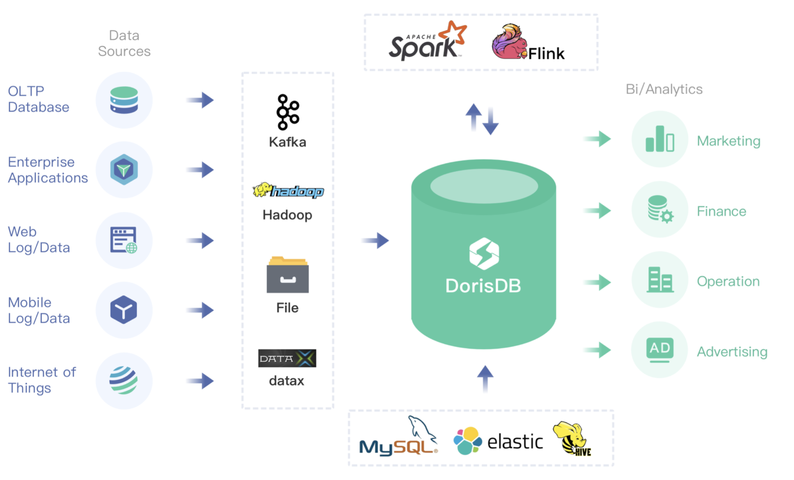

# 数据导入和查询

## 本地文件导入

为适配不同的数据导入需求，StarRocks 系统提供了5种不同的导入方式，以支持不同的数据源（如HDFS、Kafka、本地文件等），或者按不同的方式（异步或同步）导入数据。

### Broker Load

Broker Load 通过 Broker 进程访问并读取外部数据源，然后采用 MySQL 协议向 StarRocks 创建导入作业。

Broker Load适用于源数据在Broker进程可访问的存储系统（如HDFS）中，数据量为几十GB到上百GB。数据源有Hive等。

### Spark Load

Spark Load 通过外部的 Spark 资源实现对导入数据的预处理，提高 StarRocks 大数据量的导入性能并且节省 StarRocks 集群的计算资源。

Spark Load适用于初次迁移大数据量（可到TB级别）到StarRocks的场景，且源数据在Spark可访问的存储系统（如HDFS）中。

### Stream Load

Stream Load是一种同步执行的导入方式。用户通过 HTTP 协议发送请求将本地文件或数据流导入到 StarRocks中，并等待系统返回导入的结果状态，从而判断导入是否成功。

Stream Load适用于导入本地文件，或通过程序导入数据流中的数据。数据源有Flink、CSV等。

### Routine Load

Routine Load（例行导入）提供了一种自动从指定数据源进行数据导入的功能。用户通过 MySQL 协议提交例行导入作业，生成一个常驻线程，不间断的从数据源（如 Kafka）中读取数据并导入到 StarRocks 中。

### Insert Into

类似 MySQL 中的 Insert 语句，StarRocks 提供 INSERT INTO tbl SELECT ...; 的方式从 StarRocks 的表中读取数据并导入到另一张表。或者通过 INSERT INTO tbl VALUES(...); 插入单条数据。数据源有DataX/DTS、Kettle/Informatic、StarRocks本身。

<br/>

StarRocks数据导入整体生态图如下。


<br/>

具体导入方式详情请参考[数据导入](../loading/Loading_intro.md)。这里为了尽快导入测试数据，我们只介绍利用HTTP协议的Stream load方式导入。

* **示例1**：以 "table1\_20170707"为Label，使用本地文件table1\_data导入table1表。
* 在本地创建数据文件able1\_data，以逗号作为数据之间的分隔符，具体内容如下：

```Plain Text
1,1,jim,2
2,1,grace,2
3,2,tom,2
4,3,bush,3
5,3,helen,3
```

利用curl命令封装HTTP请求，完成数据的导入

```bash
curl --location-trusted -u test:123456 -T table1_data -H "label: table1_20170707" \
    -H "column_separator:," \
    http://127.0.0.1:8030/api/example_db/table1/_stream_load
```

> 注意：这里test是fe的用户名，端口8030是fe.conf中配置的http port。

* **示例2**: 以"table2\_20170707"为Label，使用本地文件table2\_data导入table2表。

在本地创建数据文件table2\_data，以逗号作为数据之间的分隔，具体内容如下：

```Plain Text
2017-07-03,1,1,jim,2
2017-07-05,2,1,grace,2
2017-07-12,3,2,tom,2
2017-07-15,4,3,bush,3
```

利用curl命令封装HTTP请求，完成数据的导入

```bash
curl --location-trusted -u test:123456 -T table2_data -H "label:table2_20170707" \
    -H "column_separator:," \
    http://127.0.0.1:8030/api/example_db/table2/_stream_load
```

  <br/>

## 查询

### 简单查询

示例:

```Plain Text
mysql> select * from table1;

+--------+----------+----------+----+
| siteid | citycode | username | pv |
+--------+----------+----------+----+
|      5 |        3 | helen    |  3 |
|      2 |        1 | grace    |  2 |
|      1 |        1 | jim      |  2 |
|      4 |        3 | bush     |  3 |
|      3 |        2 | tom      |  2 |
+--------+----------+----------+----+
```

### order by查询

示例:

```Plain Text
mysql> select * from table1 order by citycode;

+--------+----------+----------+----+
| siteid | citycode | username | pv |
+--------+----------+----------+----+
|      2 |        1 | grace    |  2 |
|      1 |        1 | jim      |  2 |
|      3 |        2 | tom      |  2 |
|      4 |        3 | bush     |  3 |
|      5 |        3 | helen    |  3 |
+--------+----------+----------+----+
5 rows in set (0.07 sec)
```

### 带有join的查询

示例:

```Plain Text
mysql> select sum(table1.pv) from table1 join table2 on table1.siteid = table2.siteid;

+--------------------+
| sum(`table1`.`pv`) |
+--------------------+
| 12                 |
+--------------------+
1 row in set (0.20 sec)
```

### 带有子查询的查询

示例:

```Plain Text
mysql> select sum(pv) from table2 where siteid in (select siteid from table1 where siteid > 2);

+-----------+
| sum(`pv`) |
+-----------+
| 8         |
+-----------+
1 row in set (0.13 sec)
```

<br/>

如果在StarRocksManager的编辑器中执行查询语句，可以查看Profile，Profile是BE执行后的结果，包含了每一个步骤的耗时和数据处理量等数据，可以通过StarRocksManager的图形界面看到可视化的Profile执行树。在StarRocksManager中执行查询，点击查询历史，就可看在“执行详情”tab中看到Profile的详细文本信息，在“执行时间”tab中能看到图形化的展示。详情见[查询分析](../administration/Query_planning.md)。

## Schema修改

### 修改Schema

使用ALTER TABLE命令可以修改表的Schema，包括如下修改：

* 增加列

* 删除列

* 修改列类型

* 改变列顺序

以下举例说明。

  <br/>

原表table1的Schema如下:

```Plain Text
+----------+-------------+------+-------+---------+-------+
| Field    | Type        | Null | Key   | Default | Extra |
+----------+-------------+------+-------+---------+-------+
| siteid   | int(11)     | Yes  | true  | 10      |       |
| citycode | smallint(6) | Yes  | true  | N/A     |       |
| username | varchar(32) | Yes  | true  |         |       |
| pv       | bigint(20)  | Yes  | false | 0       | SUM   |
+----------+-------------+------+-------+---------+-------+
```

  <br/>

我们新增一列uv，类型为BIGINT，聚合类型为SUM，默认值为0:

```sql
ALTER TABLE table1 ADD COLUMN uv BIGINT SUM DEFAULT '0' after pv;
```

  <br/>

提交成功后，可以通过以下命令查看:

```sql
SHOW ALTER TABLE COLUMN\G
```

当作业状态为FINISHED，则表示作业完成。新的Schema 已生效。

  <br/>

ALTER TABLE完成之后, 可以通过desc table查看最新的schema：

```Plain Text
mysql> desc table1;

+----------+-------------+------+-------+---------+-------+
| Field    | Type        | Null | Key   | Default | Extra |
+----------+-------------+------+-------+---------+-------+
| siteid   | int(11)     | Yes  | true  | 10      |       |
| citycode | smallint(6) | Yes  | true  | N/A     |       |
| username | varchar(32) | Yes  | true  |         |       |
| pv       | bigint(20)  | Yes  | false | 0       | SUM   |
| uv       | bigint(20)  | Yes  | false | 0       | SUM   |
+----------+-------------+------+-------+---------+-------+
5 rows in set (0.00 sec)
```

  <br/>

可以使用以下命令取消当前正在执行的作业:

```sql
CANCEL ALTER TABLE COLUMN FROM table1\G
```

  <br/>

### 创建Rollup

Rollup是StarRocks使用的一种新型预计算加速技术，可以理解为基于基础表构建的一个物化索引结构。**物化**是因为其数据在物理上独立存储，而**索引**的意思是，Rollup可以调整列顺序以增加前缀索引的命中率，也可以减少key列以增加数据的聚合度。这里仅简单举例介绍，更多相关内容请参考相关章节。

  <br/>

原表table1的Schema如下:

```Plain Text
+----------+-------------+------+-------+---------+-------+
| Field    | Type        | Null | Key   | Default | Extra |
+----------+-------------+------+-------+---------+-------+
| siteid   | int(11)     | Yes  | true  | 10      |       |
| citycode | smallint(6) | Yes  | true  | N/A     |       |
| username | varchar(32) | Yes  | true  |         |       |
| pv       | bigint(20)  | Yes  | false | 0       | SUM   |
| uv       | bigint(20)  | Yes  | false | 0       | SUM   |
+----------+-------------+------+-------+---------+-------+
```

  <br/>

对于table1明细数据是siteid, citycode, username三者构成一个key，从而对pv字段进行聚合；如果业务方经常有看城市pv总量的需求，可以建立一个只有citycode, pv的rollup：

```sql
ALTER TABLE table1 ADD ROLLUP rollup_city(citycode, pv);
```

  <br/>

提交成功后，可以通过以下命令查看:

```sql
SHOW ALTER TABLE ROLLUP\G
```

当作业状态为 FINISHED，则表示作业完成。

StarRocks 支持多种外部表：[MySQL 外部表](/data_source/External_table.md#MySQL外部表)，[Elasticsearch 外部表](/data_source/External_table.md#ElasticSearch外部表)，[Hive 外表](/data_source/External_table.md#Hive外表)，[StarRocks 外部表](/data_source/External_table.md#StarRocks外部表)，[Apache Iceberg 外表](/data_source/External_table.md#apache-iceberg%E5%A4%96%E8%A1%A8)。成功创建外部表后，可通过查询外部表的方式接入其他数据源。

Rollup建立完成之后可以使用desc table1 all查看表的rollup信息：

```Plain Text
mysql> desc table1 all;

+-------------+----------+-------------+------+-------+---------+-------+
| IndexName   | Field    | Type        | Null | Key   | Default | Extra |
+-------------+----------+-------------+------+-------+---------+-------+
| table1      | siteid   | int(11)     | Yes  | true  | 10      |       |
|             | citycode | smallint(6) | Yes  | true  | N/A     |       |
|             | username | varchar(32) | Yes  | true  |         |       |
|             | pv       | bigint(20)  | Yes  | false | 0       | SUM   |
|             | uv       | bigint(20)  | Yes  | false | 0       | SUM   |
|             |          |             |      |       |         |       |
| rollup_city | citycode | smallint(6) | Yes  | true  | N/A     |       |
|             | pv       | bigint(20)  | Yes  | false | 0       | SUM   |
+-------------+----------+-------------+------+-------+---------+-------+
8 rows in set (0.01 sec)
```

  <br/>

可以使用以下命令取消当前正在执行的作业:

```sql
CANCEL ALTER TABLE ROLLUP FROM table1;
```
