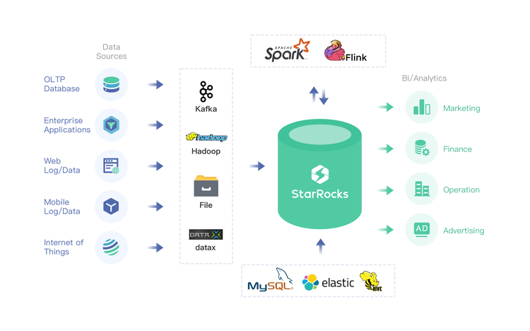

# Data import and query

## Local File Import

DorisDB provides five ways  to import data sources (e.g. HDFS, Kafka, local files, etc.), either asynchronously or synchronously.

### Broker Load

Broker Load is to access and read external data sources through the Broker and then create an import job using the MySQL protocol.

Broker Load is used when the source data is in a broker-accessible storage system (e.g. HDFS) and the data volume is tens to hundreds of GB. Data sources include Hive, etc.

### Spark Load

Spark Load leverages the external Spark resources to pre-process imported data, which improves DorisDB’s performance of importing large data volumes and saves computing resources.

Spark Load is suitable for initial migration of large data volumes (up to TB level) to DorisDB, and the source data is in a Spark-accessible storage system (e.g. HDFS).

### Stream Load

Stream Load is a synchronous import method. The user sends a request via the HTTP protocol to import a local file or data stream into DorisDB, and waits for the system to return a status indicating the import result.

Stream Load is suitable for importing local files, or importing data from a data stream through a program. Data sources include Flink, CSV, etc.

### Routine Load

Routine Load allows to automatically import data from a specified data source. The user submits a routine import job via the MySQL protocol, generating a runloop that reads data from a data source (such as Kafka) and imports it into DorisDB without interruption.

### Insert Into

Similar to the  `Insert` statement of MySQL, DorisDB supports `INSERT INTO tbl SELECT ... ;` to read data and import it to a table and `INSERT INTO tbl VALUES(...) ;` to insert a single row of data. Data sources includes DataX/DTS, Kettle/Informatic, and DorisDB itself.

The overall ecological diagram of DorisDB data import is as follows.



Here is an example of stream load using the HTTP protocol.

* **Example 1**: Import local file `tabel 1\_data` as `table 1`, label with `table1\_20170707`.
* Create the data file `table1\_data` locally, use comma to separate data, as follows:

```Plain Text
1,1,jim,2
2,1,grace,2
3,2,tom,2
4,3,bush,3
5,3,helen,3
```

Use the following curl command to send the HTTP request for data import.

```bash
curl --location-trusted -u test:123456 -T table1_data -H "label: table1_20170707" -H "column_separator:," http://127.0.0.1:8030/api/example_ db/table1/_stream_load
```

> Note that FE’s username is test. The HTTP port in `fe.conf` is `8030`.

* **Example 2**: Import local file `tabel2\_data` as `table 2`, label with `table2\_20170707`.

Create the data file `table2\_data` locally, use comma to separate data, as follows:

```Plain Text
2017-07-03,1,1,jim,2
2017-07-05,2,1,grace,2
2017-07-12,3,2,tom,2
2017-07-15,4,3,bush,3
```

Use the following curl command to send the HTTP request for data import.

```bash
curl --location-trusted -u test:123456 -T table2_data -H "label:table2_20170707" -H "column_separator:," http://127.0.0.1:8030/api/example_ db/table2/_stream_load
```

## Query

### Simple query

Example 3:

```Plain Text
mysql> select * from table1;

+--------+----------+----------+----+
| siteid | citycode | username | pv |
+--------+----------+----------+----+
|      5 |        3 | helen    |  3 |
|      2 |        1 | grace    |  2 |
|      1 |        1 | jim      |  2 |
|      4 |        3 | bush     |  3 |
|      3 |        2 | tom      |  2 |
+--------+----------+----------+----+
```

### Query with order by

Example 4:

```Plain Text
mysql> select * from table1 order by citycode;

+--------+----------+----------+----+
| siteid | citycode | username | pv |
+--------+----------+----------+----+
|      2 |        1 | grace    |  2 |
|      1 |        1 | jim      |  2 |
|      3 |        2 | tom      |  2 |
|      4 |        3 | bush     |  3 |
|      5 |        3 | helen    |  3 |
+--------+----------+----------+----+
5 rows in set (0.07 sec)
```

### Query with join

Example 5:

```Plain Text
mysql> select sum(table1.pv) from table1 join table2 where table1.siteid = table2.siteid;

+--------------------+
| sum(`table1`.`pv`) |
+--------------------+
| 12                 |
+--------------------+
1 row in set (0.20 sec)
```

### Query with subqueries

Example 6:

```Plain Text
mysql> select sum(pv) from table2 where siteid in (select siteid from table1 where siteid > 2);

+-----------+
| sum(`pv`) |
+-----------+
| 8         |
+-----------+
1 row in set (0.13 sec)
```

## Schema change

### Change the schema

The Schema of a table can be modified using the ALTER TABLE command. Specifically, you can

* Add columns
* Delete columns
* Modify column type
* Change column order

See the following examples.

The Schema of the original table1 is as follows:

```Plain Text
+----------+-------------+------+-------+---------+-------+
| Field    | Type        | Null | Key   | Default | Extra |
+----------+-------------+------+-------+---------+-------+
| siteid   | int(11)     | Yes  | true  | 10      |       |
| citycode | smallint(6) | Yes  | true  | N/A     |       |
| username | varchar(32) | Yes  | true  |         |       |
| pv       | bigint(20)  | Yes  | false | 0       | SUM   |
+----------+-------------+------+-------+---------+-------+
```

Add a new column `uv` whose type is `BIGINT` and aggregation type is `SUM` with a default value of `0`:

```sql
ALTER TABLE table1 ADD COLUMN uv BIGINT SUM DEFAULT '0' after pv;
```

After submission, you can view the status with the following command:

```sql
SHOW ALTER TABLE COLUMN\G
```

Job status is `FINISHED`, meaning the job is complete. The new schema has taken effect.

Once `ALTER TABLE` is completed, you can check the latest schema using `desc table`.

```Plain Text
mysql> desc table1;

+----------+-------------+------+-------+---------+-------+
| Field    | Type        | Null | Key   | Default | Extra |
+----------+-------------+------+-------+---------+-------+
| siteid   | int(11)     | Yes  | true  | 10      |       |
| citycode | smallint(6) | Yes  | true  | N/A     |       |
| username | varchar(32) | Yes  | true  |         |       |
| pv       | bigint(20)  | Yes  | false | 0       | SUM   |
| uv       | bigint(20)  | Yes  | false | 0       | SUM   |
+----------+-------------+------+-------+---------+-------+
5 rows in set (0.00 sec)
```

You can cancel the running job with the following command:

```sql
CANCEL ALTER TABLE COLUMN FROM table1\G
```

### Create Roll up

Rollup is a new pre-aggregate acceleration technique used by DorisDB, which can be regarded as a materialized indexing structure built on the base table. By materialized, it means data is stored independently. By indexting, it means rollup can adjust the column order to increase the hit rate of prefix indexes, and also reduce key columns to make data aggregation efficient.

The schema of the original table1 is as follows:

```Plain Text
+----------+-------------+------+-------+---------+-------+
| Field    | Type        | Null | Key   | Default | Extra |
+----------+-------------+------+-------+---------+-------+
| siteid   | int(11)     | Yes  | true  | 10      |       |
| citycode | smallint(6) | Yes  | true  | N/A     |       |
| username | varchar(32) | Yes  | true  |         |       |
| pv       | bigint(20)  | Yes  | false | 0       | SUM   |
| uv       | bigint(20)  | Yes  | false | 0       | SUM   |
+----------+-------------+------+-------+---------+-------+
```

For `table1`, its detailed data `siteid`, `citycode`, `username` form a key that is used to aggregate `pv`. If users need to track cities’ pv numbers, you can create a rollup of `citycode` and `pv`.

```sql
ALTER TABLE table1 ADD ROLLUP rollup_city(citycode, pv);
```

After submission, you can view the status using the following command:

```sql
SHOW ALTER TABLE ROLLUP\G
```

Job status is `FINISHED`, meaning the job is completed.

After the rollup is created, you can use `desc table1` all to view the rollup information of the table.

```Plain Text
mysql> desc table1 all;

+-------------+----------+-------------+------+-------+---------+-------+
| IndexName   | Field    | Type        | Null | Key   | Default | Extra |
+-------------+----------+-------------+------+-------+---------+-------+
| table1      | siteid   | int(11)     | Yes  | true  | 10      |       |
|             | citycode | smallint(6) | Yes  | true  | N/A     |       |
|             | username | varchar(32) | Yes  | true  |         |       |
|             | pv       | bigint(20)  | Yes  | false | 0       | SUM   |
|             | uv       | bigint(20)  | Yes  | false | 0       | SUM   |
|             |          |             |      |       |         |       |
| rollup_city | citycode | smallint(6) | Yes  | true  | N/A     |       |
|             | pv       | bigint(20)  | Yes  | false | 0       | SUM   |
+-------------+----------+-------------+------+-------+---------+-------+
8 rows in set (0.01 sec)
```

You can cancel the running job with the following command:

```sql
CANCEL ALTER TABLE ROLLUP FROM table1;
```
