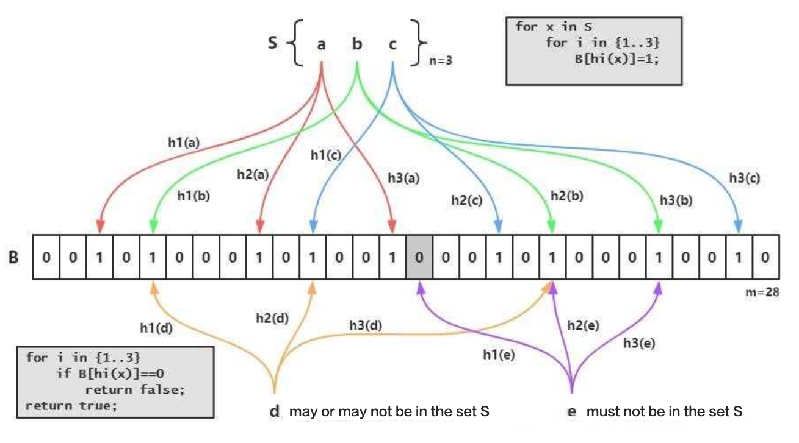

# Bloomfilter 索引

## 原理

### **1 什么是 Bloom Filter**

Bloom Filter（布隆过滤器）是用于判断某个元素是否在一个集合中的数据结构，优点是空间效率和时间效率都比较高，缺点是有一定的误判率。

布隆过滤器是由一个Bit数组和n个哈希函数构成。Bit数组初始全部为0，当插入一个元素时，n个Hash函数对元素进行计算, 得到n个slot，然后将Bit数组中n个slot的Bit置1。

当我们要判断一个元素是否在集合中时，还是通过相同的n个Hash函数计算Hash值，如果所有Hash值在布隆过滤器里对应的Bit不全为1，则该元素不存在。当对应Bit全1时, 则元素的存在与否, 无法确定.  这是因为布隆过滤器的位数有限,  由该元素计算出的slot, 恰好全部和其他元素的slot冲突.  所以全1情形, 需要回源查找才能判断元素的存在性。

### **2 什么是 Bloom Filter 索引**

StarRocks的建表时, 可通过`PROPERTIES{"bloom\_filter\_columns"="c1,c2,c3"}`指定需要建BloomFilter索引的列，查询时, BloomFilter可快速判断某个列中是否存在某个值。如果Bloom Filter判定该列中不存在指定的值，就不需要读取数据文件；如果是全1情形，此时需要读取数据块确认目标值是否存在。另外，Bloom Filter索引无法确定具体是哪一行数据具有该指定的值。

## 适用场景

满足以下几个条件时可以考虑对某列建立Bloom Filter 索引：

1. 首先BloomFilter也适用于非前缀过滤。
2. 查询会根据该列高频过滤，而且查询条件大多是in和=。
3. 不同于Bitmap, BloomFilter适用于高基数列。

## 如何使用

### **1 创建索引**

建表时使用指定bloom\_filter\_columns即可：

~~~ SQL
PROPERTIES ( "bloom_filter_columns"="k1,k2,k3" )
~~~

### **2 查看索引**

展示指定table\_name下的Bloom Filter索引：

~~~ SQL
SHOW CREATE TABLE table_name;
~~~

### **3 删除索引**

删除索引即为将索引列从bloom\_filter\_columns属性中移除：

~~~SQL
ALTER TABLE example_db.my_table SET ("bloom_filter_columns" = "");
~~~

### **4 修改索引**

修改索引即为修改表的bloom\_filter\_columns属性：

~~~SQL
ALTER TABLE example_db.my_table SET ("bloom_filter_columns" = "k1,k2,k3");
~~~

## 注意事项

* 不支持对Tinyint、Float、Double、Decimal 类型的列建Bloom Filter索引。
* Bloom Filter索引只对in和=过滤查询有加速效果。
* 如果要查看某个查询是否命中了Bloom Filter索引，可以通过查询的Profile信息查看（TODO：加上查看Profile的链接）。
