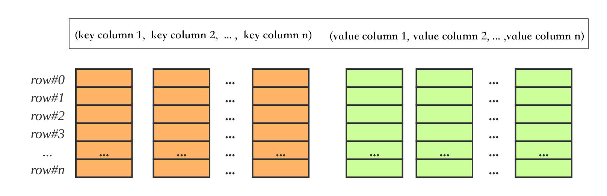
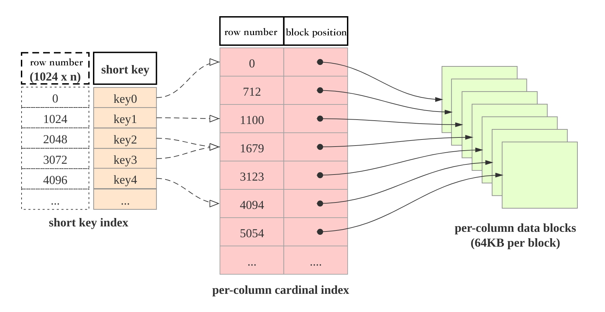

# Table Design

## Columnar Storage

Similar to relational database tables, a StarRocks table consists of rows and columns. Each row of data corresponds to one record, and data in each column share the same data type. All data rows have the same number of columns, and columns can be added or deleted dynamically. In StarRocks, there are two types of columns --  key columns and value columns. The key columns are used for grouping and sorting, and value columns can be aggregated by `SUM,` `COUNT`, `MIN`, `MAX`, `REPLACE`, `HLL\_UNION`, `BITMAP\_UNION`, etc. Therefore, a StarRocks table can also be considered as a mapping of multidimensional keys to multidimensional metrics.

In StarRocks, data is stored in table columns. Physically, a column of data is chunked, encoded, and compressed, ending up being persisted on non-volatile storage. Logically, a column of data can be viewed as a vector of elements of the same type. All columns of a row of data remain aligned in their respective column vectors, i.e., they have the same vector subscript which is called the ordinal number or row number. The ordinal number is implicit and does not need to be stored. All rows in the table are sorted multiple times by key columns, and the sorted position is the row number of that row.

When querying, if you set the equality  or range conditions of key columns and the key columns form the prefix of the table’s key columns, then you can leverage the orderliness of data and use `range-scan` to quickly target rows. Take table1: `event_day, siteid, citycode, username`➜`pv` for instance. If the query condition is `event_day > 2020-09-18 and siteid = 2`, then you can use range-scan; if the query condition is `citycode = 4` and username in `["Andy", "Boby", "Christian", "StarRocks"]`, then you cannot use range-scan.

## Sparse Indexing

When performing range search, how to quickly find the beginning and end of the target row? The answer is `shortkey indexing` (aka sparse indexing) as shown below.

The data table consists of three components:

1. Shortkey index table: The shortkey index is a sparse index. Every 1024 rows of data constitute a logical block. Each logical block stores an index in the shortkey index table. The index contains the first 36 bytes of the starting row which can be used to locate the starting row of the block.
2. Per-column data block: Each column of data is stored in 64KB chunks, and the data block is encoded and compressed as an I/O unit to support data read and write.
3. Per-column cardinal index: Each column of data has its own per-column cardinal index. The index consists of the starting row number, position, and length information of the data block. With the starting row number, you can locate the index and get the other information of the data.  

Thus, the process to find the prefix of the key column is as follows:
First,  look up the shortkey index, and get the starting row number of the logical block;
Second,  look up the per-column cardinal index, and get the data block of the target column;
Third, read the data block, that is, to decompress and decode it to get the data item corresponding to the prefix of the key column.

## Speed up data processing

1. Pre-aggregation: StarRocks supports an aggregation model where data rows with the same key column values can be merged. The key column values of the merged rows remain unchanged, while the value column shows aggregated results. The user needs to specify the aggregation function for the value column. The aggregation operation can be accelerated by pre-aggregation.
2. Partitioning and bucketing: In fact, StarRocks tables are divided into tablets whose replicas are stored on BEs. The number of BEs and tablets can be scaled according to computing resources and data size. When querying, multiple BEs can be used in parallel to look up tablets  and get data quickly. In addition, the tablet replicas can be copied and migrated, which enhances data reliability and avoids data skew. In short, partitioning and bucketing ensure query efficiency and stability.
3. RollUp table index: Shortkey indexing leverages the sequence of key columns to speed up queries. If you use non-prefixed key columns as a query condition, shortkey indexing won’t work. In this case, you can create several RollUp table indexes. The data layout and storage of RollUp table indexes are the same as tables. However, RollUp tables have their own shortkey indexes. When creating the RollUp tables, you can design the dimension of aggregation, the number of columns, and the sequence of the key columns, to ensure that frequently used query conditions will hit the corresponding RollUp table indexes.
4. Columnar indexing techniques: Bloomfilter can quickly determine whether the data block contains the queried value, ZoneMap can quickly filter the value bydata range, and Bitmap indexes can quickly find the target row from the columns of enumerated types that satisfy certain conditions.

For more details on table design, see the following sections.
