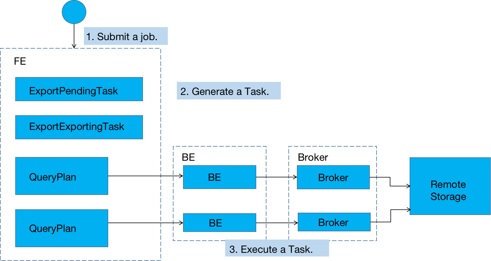

# 导出总览

数据导出（Export）是 StarRocks 提供的一种将数据导出并存储到其他介质上的功能。该功能可以将用户指定的表或分区的数据，以**文本**的格式，通过 Broker 进程导出到远端存储上，如 HDFS/阿里云OSS/AWS S3（或者兼容S3协议的对象存储） 等。

本章介绍StarRocks数据导出的基本原理、使用方式、最佳实践以及注意事项。

## 名词解释

* **Broker**：StarRocks 可以通过 Broker 进程对远端存储进行文件操作。
* **Tablet**：数据分片。一个表会分成 1 个或多个分区，每个分区会划分成多个数据分片。

## 原理

### 导出作业的执行流程

用户提交一个**导出作业**后，StarRocks 会统计这个作业涉及的所有 Tablet，然后对这些 Tablet 进行**分组**，**每组生成一个**特殊的**查询计划**。该**查询计划**会读取所包含的 Tablet 上的数据，然后通过 Broker 将数据写到远端存储指定的路径中。

导出作业的总体处理流程如下:

上图描述的处理流程主要包括：

1. 用户提交一个 Export 作业到 FE。
2. FE 的导出调度器会通过两阶段来执行一个导出作业：

    a.  PENDING：FE 生成**一个** ExportPendingTask，向 BE 发送 snapshot 命令，对所有涉及到的 Tablet 做一个快照，并生成**多个**查询计划。

    b.  EXPORTING：FE 生成**一个** ExportExportingTask，开始执行**一个个**的查询计划。

### 查询计划拆分

Export 作业会生成多个查询计划，每个查询计划负责扫描一部分 Tablet。每个查询计划中**每个 BE** 扫描的数据量由 FE 配置参数 `export_max_bytes_per_be_per_task` 计算得到，默认为 256M。每个查询计划中每个 BE 最少一个 Tablet，最多导出的数据量不超过配置的参数 `export_max_bytes_per_be_per_task`。

一个作业的多个查询计划**并行执行**，任务线程池的大小通过 FE 参数 `export_task_pool_size` 配置，默认为 5。

### 查询计划执行

一个查询计划扫描多个分片，将读取的数据以行的形式组织，每 1024 行为一个 batch，调用 Broker 写入到远端存储上。

查询计划遇到错误会整体自动重试 3 次。如果一个查询计划重试 3 次依然失败，则整个作业失败。

StarRocks 会首先在指定的远端存储的路径中，建立一个名为 `__starrocks_export_tmp_921d8f80-7c9d-11eb-9342-acde48001122` 的临时目录（其中 `921d8f80-7c9d-11eb-9342-acde48001122` 为作业的 query id）。导出的数据首先会写入这个临时目录。每个查询计划会生成一个文件，文件名示例：

`lineorder_921d8f80-7c9d-11eb-9342-acde48001122_1_2_0.csv.1615471540361`

其中:

* `1615471540361` 为时间戳，用于保证重试生成的文件不冲突。

当所有数据都导出后，StarRocks 会将这些文件 **rename** 到用户指定的路径中，rename的时候会去掉后面的时间戳。最终导出的文件名示例：

`lineorder_921d8f80-7c9d-11eb-9342-acde48001122_1_2_0.csv`

其中:

* `lineorder_`：为导出文件的前缀，由用户指定到导出路径中，不指定默认为`data_`。
* `921d8f80-7c9d-11eb-9342-acde48001122`：为作业的 query id。文件名默认包含 query id，指定参数 include_query_id = false 后不包含。
* `1_2_0`：分为三部分，第一部分为**查询计划**对应任务的序号，第二部分为任务中**实例**的序号，第三部分为一个实例中**生成文件**的序号。
* `csv`：为导出文件格式，目前只支持 csv 格式。

#### Broker 参数

导出作业需要借助 Broker 进程访问远端存储，不同的 Broker 需要提供不同的参数，具体请参阅 Broker文档。

### 使用示例

#### 提交导出作业

数据导出命令的详细语法可以通过 `HELP EXPORT` 查看。导出作业举例如下：

~~~sql
EXPORT TABLE db1.tbl1 
PARTITION (p1,p2)
(col1, col3)
TO "hdfs://host/path/to/export/lineorder_" 
PROPERTIES
(
    "column_separator"=",",
    "load_mem_limit"="2147483648",
    "timeout" = "3600"
)
WITH BROKER "hdfs"
(
    "username" = "user",
    "password" = "passwd"
);
~~~

可以指定需要导出的分区，不写默认导出表中所有分区。

可以指定需要导出的列，顺序可以跟 schema 不同，不写默认导出表中所有列。

导出路径**如果指定到目录**，需要指定最后的`/`，否则最后的部分会被当做导出文件的前缀。不指定前缀默认为`data_`。
示例中导出文件会生成到 export 目录中，文件前缀为 `lineorder_`。

PROPERTIES如下：

* `column_separator`：列分隔符。默认为 `\t`。
* `line_delimiter`：行分隔符。默认为 `\n`。
* `load_mem_limit`： 表示 Export 作业中，**一个查询计划**在**单个 BE** 上的内存使用限制。默认 2GB。单位字节。
* `timeout`：作业超时时间。默认为 2 小时。单位秒。
* `include_query_id`: 导出文件名中是否包含 query id，默认为 true。

### 获取导出作业 query id

提交作业后，可以通过 `SELECT LAST_QUERY_ID()` 命令获得导出作业的 query id。用户可以通过 query id 查看或者取消作业。

### 查看导出作业状态

提交作业后，可以通过 `SHOW EXPORT` 命令查询导出作业状态。

~~~sql
SHOW EXPORT WHERE queryid = "921d8f80-7c9d-11eb-9342-acde48001122";
~~~

结果举例如下：

~~~sql
     JobId: 14008
     State: FINISHED
  Progress: 100%
  TaskInfo: {"partitions":["*"],"mem limit":2147483648,"column separator":",","line delimiter":"\n","tablet num":1,"broker":"hdfs","coord num":1,"db":"default_cluster:db1","tbl":"tbl3",columns:["col1", "col3"]}
      Path: oss://bj-test/export/
CreateTime: 2019-06-25 17:08:24
 StartTime: 2019-06-25 17:08:28
FinishTime: 2019-06-25 17:08:34
   Timeout: 3600
  ErrorMsg: N/A
~~~

* JobId：作业的唯一 ID
* State：作业状态：
  * PENDING：作业待调度
  * EXPORING：数据导出中
  * FINISHED：作业成功
  * CANCELLED：作业失败

* Progress：作业进度。该进度以查询计划为单位。假设一共 10 个查询计划，当前已完成 3 个，则进度为 30%。
* TaskInfo：以 Json 格式展示的作业信息：
  * db：数据库名
  * tbl：表名
  * partitions：指定导出的分区。\*表示所有分区。
  * mem limit：查询的内存使用限制。单位字节。
  * column separator：导出文件的列分隔符。
  * line delimiter：导出文件的行分隔符。
  * tablet num：涉及的总 Tablet 数量。
  * broker：使用的 broker 的名称。
  * coord num：查询计划的个数。
  * columns：导出的列。

* Path：远端存储上的导出路径。
* CreateTime/StartTime/FinishTime：作业的创建时间、开始调度时间和结束时间。
* Timeout：作业超时时间。单位是「秒」。该时间从 CreateTime 开始计算。
* ErrorMsg：如果作业出现错误，这里会显示错误原因。

#### 取消作业

举例如下：

~~~sql
CANCEL EXPORT WHERE queryid = "921d8f80-7c9d-11eb-9342-acde48001122";
~~~

### 最佳实践

#### 查询计划的拆分

一个 Export 作业有多少查询计划需要执行，取决于总共有多少 Tablet，以及一个查询计划可以处理的最大数据量。
作业是按照查询计划来重试的，如果一个查询计划处理更多的数据量，查询计划出错（比如调用 Broker 的 RPC 失败，远端存储出现抖动等），会导致一个查询计划的重试成本变高。每个查询计划中每个 BE 扫描的数据量由 FE 配置参数 `export_max_bytes_per_be_per_task` 计算得到，默认为 256M。每个查询计划中每个 BE 最少一个 Tablet，最多导出的数据量不超过配置的参数 `export_max_bytes_per_be_per_task`。

一个作业的多个查询计划并行执行，任务线程池的大小通过 FE 参数 `export_task_pool_size` 配置，默认为 5。

#### load_mem_limit

通常一个导出作业的查询计划只有「扫描\-导出」两部分，不涉及需要太多内存的计算逻辑。所以通常 2GB 的默认内存限制可以满足需求。但在某些场景下，比如一个查询计划，在同一个 BE 上需要扫描的 Tablet 过多，或者 Tablet 的数据版本过多时，可能会导致内存不足。此时需要修改这个参数设置更大的内存，比如 4GB、8GB 等。

### 注意事项

* 不建议一次性导出大量数据。一个 Export 作业建议的导出数据量最大在几十 GB。过大的导出会导致更多的垃圾文件和更高的重试成本。
* 如果表数据量过大，建议按照分区导出。
* 在 Export 作业运行过程中，如果 FE 发生重启或切主，则 Export 作业会失败，需要用户重新提交。
* Export 作业产生的`__starrocks_export_tmp_xxx`临时目录，作业失败或成功后会自动删除。
* 当 Export 运行完成后（成功或失败），FE 发生重启或切主，则`SHOW EXPORT`展示的作业的部分信息会丢失，无法查看。
* Export 作业只会导出 Base 表的数据，不会导出 Rollup Index 的数据。
* Export 作业会扫描数据，占用 IO 资源，可能会影响系统的查询延迟。

### 相关配置

主要介绍 FE 中的相关配置。

* `export_checker_interval_second`：Export 作业调度器的调度间隔，默认为 5 秒。设置该参数需重启 FE。
* `export_running_job_num_limit`：正在运行的 Export 作业数量限制。如果超过，则作业将等待并处于 PENDING 状态。默认为 5，可以运行时调整。
* `export_task_default_timeout_second`：Export 作业默认超时时间。默认为 2 小时。可以运行时调整。
* `export_max_bytes_per_be_per_task`: 每个导出任务在每个 BE 上最多导出的数据量，用于拆分导出作业并行处理。按压缩后数据量计算，默认为 256M。
* `export_task_pool_size`: 导出任务线程池的大小。默认为 5。
