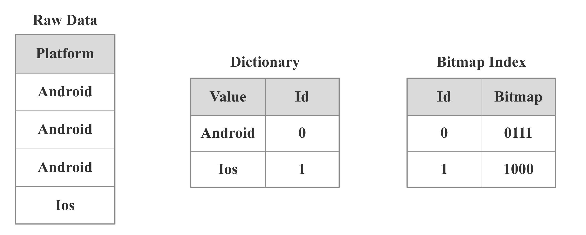

# Bitmap 索引

StarRocks 支持Bitmap索引，对于有Filter的查询有明显的加速效果。

## 原理

### **1 什么是Bitmap**

Bitmap是元素为bit的， 取值为0、1两种情形的, 可对某一位bit进行置位(set)和清零(clear)操作的数组。

Bitmap的使用场景举例有：

* 用一个long型表示32位学生的性别，0表示女生，1表示男生。
* 用Bitmap表示一组数据中是否存在null值，0表示元素不为null，1表示为null。
* 一组数据的取值为(Q1, Q2, Q3, Q4)，表示季度，用Bitmap表示这组数据中取值为Q4的元素，1表示取值为Q4的元素, 0表示其他取值的元素。

### **2 什么是Bitmap索引**

Bitmap只能表示取值为两种情形的列数组, 当列的取值为多种取值情形枚举类型时, 例如季度(Q1, Q2, Q3, Q4),  系统平台(Linux, Windows, FreeBSD, MacOS), 则无法用一个Bitmap编码,此时可以为每个取值各自建立一个Bitmap的来表示这组数据,同时为实际枚举取值建立词典。

如上图所示，Platform列有4行数据，可能的取值有Android、Ios。StarRocks中会首先针对Platform列构建一个字典，将Android和Ios映射为int，然后就可以对Android和Ios分别构建Bitmap。具体来说，我们分别将Android、Ios 编码为0和1，因为Android出现在第1，2，3行，所以Bitmap是0111，因为Ios出现在第4行，所以Bitmap是1000。

假如有一个针对包含该Platform列的表的SQL查询，select xxx from table where Platform = iOS，StarRocks会首先查找字典，找出iOS对于的编码值是1，然后再去查找 Bitmap Index，知道1对应的Bitmap是1000，我们就知道只有第4行数据符合查询条件，StarRocks就会只读取第4行数据，不会读取所有数据。

## 适用场景

### **1 非前缀过滤**

StarRocks对于建表中的前置列可以通过shortkey索引快速过滤，但是对于非前置列, 无法利用shortkey索引快速过滤，如果需要对非前置列进行快速过滤，就可以对这些列建立Bitmap索引。

### **2 多列过滤Filter**

由于Bitmap可以快速的进行bitwise运算。所以在多列过滤的场景中，也可以考虑对每列分别建立Bitmap索引。

## 如何使用

### **1 创建索引**

在 table1 上为site\_id 列创建 Bitmap 索引：

~~~ SQL
CREATE INDEX index_name ON table1 (site_id) USING BITMAP COMMENT 'balabala';
~~~

### **2 查看索引**

展示指定 table\_name 的下索引：

~~~ SQL
SHOW INDEX FROM [example_db].table_name;
~~~

### **3 删除索引**

下面语句可以从一个表中删除指定名称的索引：

~~~ SQL
DROP INDEX index_name ON [db_name.]table_name;
~~~

## 注意事项

1. 对于明细模型，所有列都可以建Bitmap 索引；对于聚合模型，只有Key列可以建Bitmap 索引。
2. Bitmap索引, 应该在取值为枚举型、 取值大量重复、 较低基数、 并且用作等值条件查询或者可转化为等值条件查询的列上时进行创建。
3. 不支持为 FLOAT、DOUBLE、BOOLEAN 和 DECIMAL 类型的列建 bitmap 索引。
4. 如果要查看某个查询是否命中了Bitmap索引，可以通过查询的[Profile](https://docs.starrocks.com/zh-cn/main/administration/Query_planning#profile%E5%88%86%E6%9E%90)信息来进行查看（通过查询信息中rollup所展示的信息去核对物化视图是否命中或者命中正确）。
